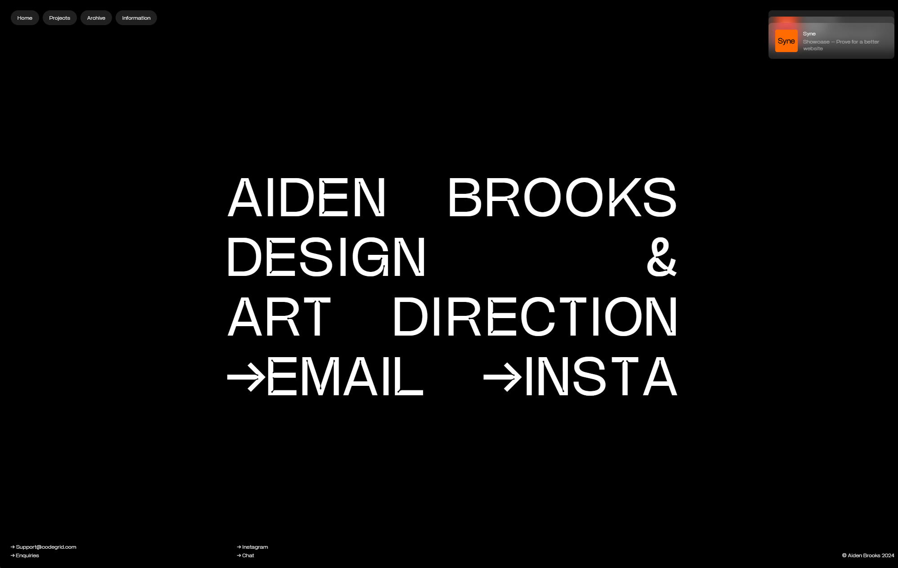
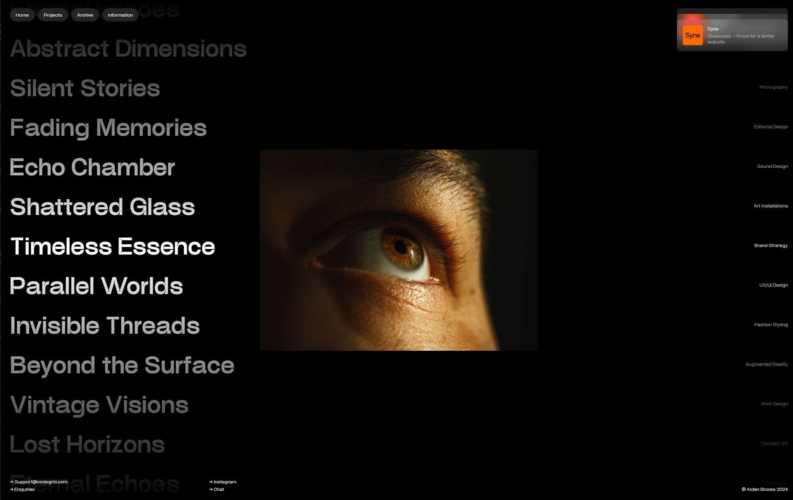

<div align="center">
  <br />
  
  <br />
  <br />

  <div>
    
    
    
    
    
    
    
  </div>

  <h3 align="center">Aiden Brooks — Design & Art Direction Portfolio</h3>
  <p align="center">A fast, minimal, motion‑driven portfolio built with React + Vite.</p>
</div>

## Table of Contents

1. [Introduction](#introduction)
2. [Features](#features)
3. [Tech Stack](#tech-stack)
4. [Screenshots](#screenshots)
5. [Getting Started](#getting-started)
6. [Scripts](#scripts)
7. [Project Structure](#project-structure)

## Introduction

This repository contains a single‑page portfolio (SPA) for Aiden Brooks. It emphasizes bold typography, smooth scroll, and tasteful motion to showcase design and art‑direction work. The app is powered by React and Vite with client‑side routing, fluid transitions, and accessible navigation.

## Features

- Bold, typography‑first layout with dark theme
- Smooth scrolling powered by Lenis
- Route‑based navigation with `react-router-dom`
- Micro‑interactions and transitions via Framer Motion and GSAP
- Optimized Vite dev experience with hot‑reload
- Linting and best‑practice checks with ESLint

## Tech Stack

- React 18 + Vite 5
- React Router DOM 6
- Framer Motion 11, GSAP 3
- Lenis (smooth scrolling)
- ESLint (code quality)

## Screenshots

<p align="center">
  
  <br />
  <em>Landing screen</em>
</p>

<<<<<<< Current (Your changes)
- [@vitejs/plugin-react](https://github.com/vitejs/vite-plugin-react/blob/main/packages/plugin-react/README.md)
  uses [Babel](https://babeljs.io/) for Fast Refresh
- [@vitejs/plugin-react-swc](https://github.com/vitejs/vite-plugin-react-swc)
  uses [SWC](https://swc.rs/) for Fast Refresh
=======
<p align="center">
  
  <br />
  <em>Projects list with hover preview</em>
</p>

## Getting Started

### Prerequisites

- Node.js 18+
- npm (comes with Node)

### Installation

```bash
npm install
```

### Development

```bash
npm run dev
```

Open `http://localhost:5173` in your browser.

### Production build

```bash
npm run build
npm run preview
```

## Scripts

- `dev` – start the Vite dev server
- `build` – build production assets
- `preview` – preview the production build locally
- `lint` – run ESLint across the codebase

## Project Structure

```
aiden-brooks/
├─ public/
│  ├─ aiden-brooks1.png
│  └─ aiden-brooks2.png
├─ src/
│  ├─ pages/            # routed pages
│  ├─ components/       # reusable UI parts
│  ├─ assets/           # images/fonts
│  ├─ App.jsx
│  └─ main.jsx
├─ index.html
└─ vite.config.js
```

---

If you find this project helpful, feel free to ⭐ the repo and adapt it to your own portfolio. PRs for improvements and accessibility fixes are welcome.
>>>>>>> Incoming (Background Agent changes)
