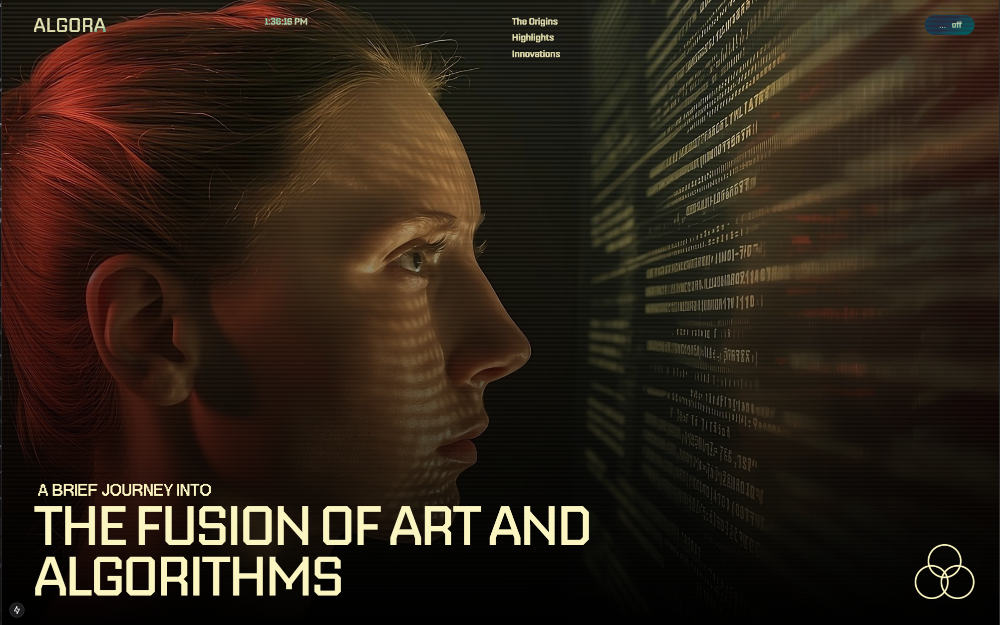
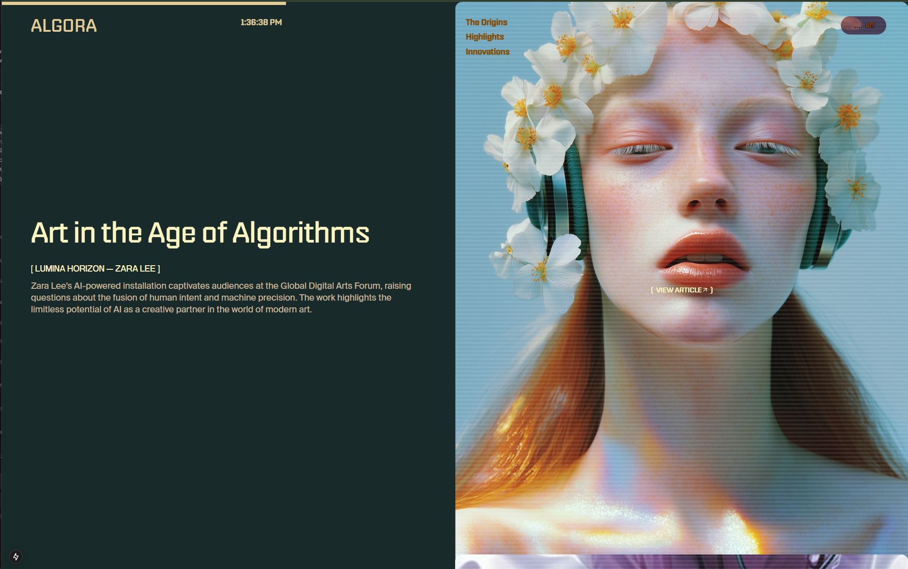
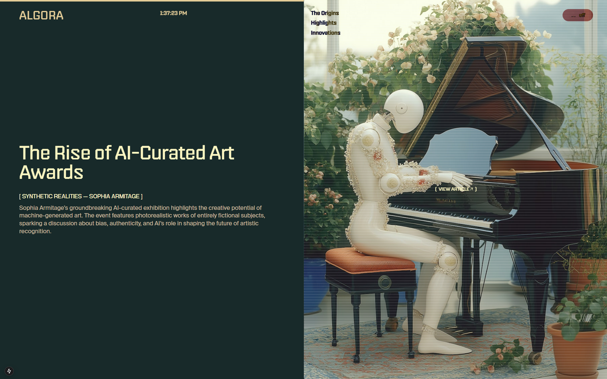

<div align="center">
  <br />
  
  <br />
  <br />

  <div>
    
    
    
    
    
    
    
  </div>

  <h3 align="center">Algora — The Fusion of Art and Algorithms</h3>
  <p align="center">A motion‑driven Next.js site with cinematic visuals, smooth scroll, and editorial storytelling.</p>
  
  <p align="center">
    <a href="https://my-projectalgora.vercel.app/" target="_blank">
      
    </a>
  </p>
</div>

## Table of Contents

1. [Introduction](#introduction)
2. [Features](#features)
3. [Tech Stack](#tech-stack)
4. [Screenshots](#screenshots)
5. [Getting Started](#getting-started)
6. [Scripts](#scripts)
7. [Project Structure](#project-structure)

## Introduction

Algora is a modern website built with Next.js that explores the intersection of art and algorithms. It blends rich, editorial typography with immersive motion and scroll‑based effects to present highlights, origins, and innovations in a clean two‑column layout.

## Features

- App Router architecture with fast server‑side rendering
- Lenis‑powered smooth scrolling and inertia
- Cinematic transitions via GSAP and Framer‑style timelines with `@gsap/react`
- Lottie‑web for lightweight vector animations
- Split‑Type for dynamic text effects and reveals
- Fully responsive and keyboard‑navigable sections

## Tech Stack

- Next.js 15 (App Router)
- React 18
- GSAP 3 + `@gsap/react`
- `@studio-freight/react-lenis` (smooth scrolling)
- `lottie-web` (SVG animations)
- `split-type` (typographic effects)

## Screenshots

<p align="center">
  
  <br />
  <em>Hero section with scanline aesthetic</em>
</p>

<p align="center">
  
  <br />
  <em>Editorial layout with image‑led storytelling</em>
</p>

<p align="center">
  
  <br />
  <em>Two‑column section and subtle motion cues</em>
</p>

## Getting Started

### Prerequisites

- Node.js 18+

### Installation

```bash
npm install
```

### Development

```bash
npm run dev
```

Open `http://localhost:3000` in your browser.

### Production

```bash
npm run build
npm start
```

## Scripts

- `dev` – start local dev server
- `build` – production build
- `start` – run the built app
- `lint` – run Next.js ESLint checks

## Project Structure

```
algora/
├─ public/
│  ├─ algora1.png
│  ├─ algora2.png
│  └─ algora3.png
├─ src/
│  ├─ app/              # App Router pages and layouts
│  └─ components/       # UI components and sections
├─ next.config.mjs
└─ package.json
```

---

If this project inspires you, ⭐ the repo and adapt it to your own narrative. Contributions that improve performance, accessibility, or motion quality are welcome.
