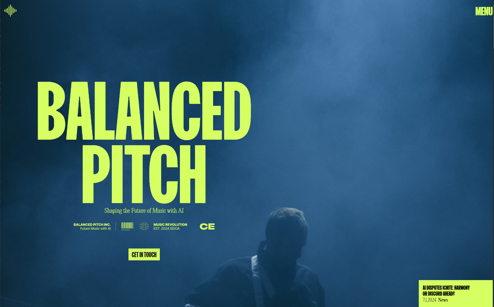
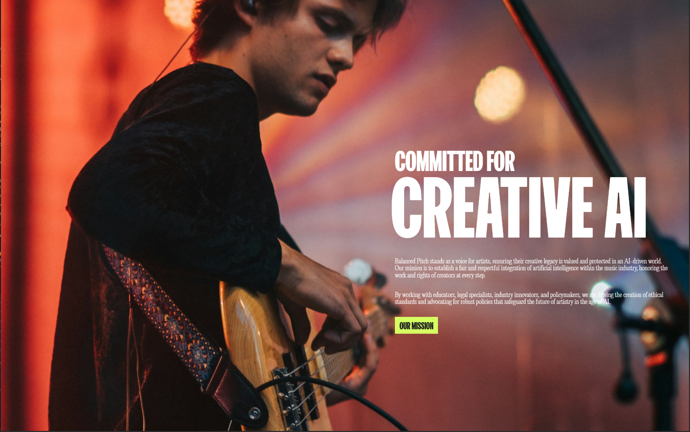

<div align="center">
  <br />
  
  <br />
  <br />

  <div>
    
    
    
    
    
    
    
  </div>

  <h3 align="center">Balanced Pitch — Shaping the Future of Music with AI</h3>
  <p align="center">A bold, motion‑first React + Vite site with editorial design and smooth scroll.</p>
</div>

## Table of Contents

1. [Introduction](#introduction)
2. [Features](#features)
3. [Tech Stack](#tech-stack)
4. [Screenshots](#screenshots)
5. [Getting Started](#getting-started)
6. [Scripts](#scripts)
7. [Project Structure](#project-structure)

## Introduction

Balanced Pitch is a single‑page React site highlighting how AI meets music. It features oversized typography, vibrant neon accent colors, and cinematic sections powered by GSAP and Framer Motion. Navigation is handled client‑side with React Router, and Lenis provides buttery‑smooth scrolling.

## Features

- Hero with large display type and CTA
- Section reveals and parallax‑style motion with GSAP/Framer Motion
- Smooth scrolling via Lenis and `@studio-freight/react-lenis`
- Client‑side routes with React Router 7
- Responsive layout and keyboard accessibility
- Linting and best‑practices via ESLint

## Tech Stack

- React 18 + Vite 5
- React Router 7
- Framer Motion 11, GSAP 3
- Lenis, `@studio-freight/react-lenis`
- ESLint

## Screenshots

<p align="center">
  
  <br />
  <em>Hero section</em>
</p>

<p align="center">
  
  <br />
  <em>From Innovation to Iconic — editorial layout</em>
</p>

<p align="center">
  
  <br />
  <em>Committed for Creative AI — image‑led storytelling</em>
</p>

## Getting Started

### Prerequisites

- Node.js 18+

### Installation

```bash
npm install
```

### Development

```bash
npm run dev
```

Open `http://localhost:5173` in your browser.

### Production build

```bash
npm run build
npm run preview
```

## Scripts

- `dev` – start the Vite dev server
- `build` – build production assets
- `preview` – preview the production build locally
- `lint` – run ESLint across the codebase

## Project Structure

```
balanced-pitch/
├─ public/
│  ├─ balanced-pitch1.png
│  ├─ balanced-pitch2.png
│  └─ balanced-pitch3.png
├─ src/
│  ├─ pages/            # routes
│  ├─ components/       # reusable UI parts
│  ├─ assets/           # images/fonts
│  ├─ App.jsx
│  └─ main.jsx
├─ index.html
└─ vite.config.js
```

---

If you enjoy this project, ⭐ the repo and adapt it to your own product or studio site. Contributions improving performance, accessibility, or motion are welcome.
