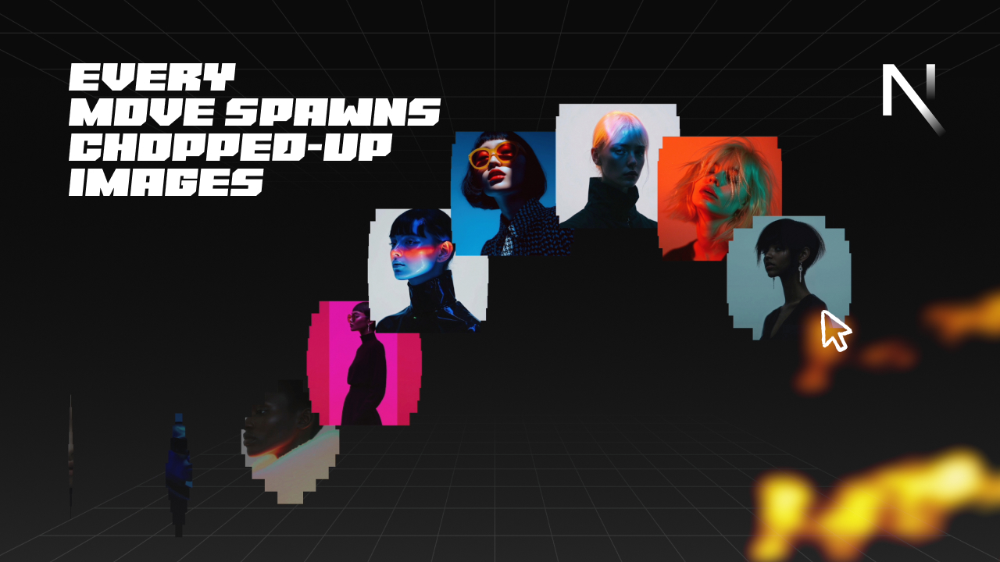

# Frontend Codebase Analysis: CG 24/7 Artists Trail Next.js

<div align="center">
  <br />
  
  <br />
  <br />

  <div>
    
    
    
    
    
  </div>

  <h3 align="center">CG 24/7 Artists Trail — Interactive Image Trail Animation</h3>
  <p align="center">An advanced mouse-following image trail system with sophisticated clip-path animations and smooth transitions.</p>
</div>

## 🖼 Project Showcase

This project demonstrates an advanced interactive image trail system that creates a sophisticated mouse-following animation experience. The main scenario involves a hero section with a background image where moving the mouse creates a trail of artist images that appear with complex clip-path animations, slide to follow the cursor, and fade out with staggered timing. The tech stack solves complex mouse tracking, smooth animations, and performance optimization through React hooks, custom animation logic, and CSS clip-path properties.

## 📁 Project Structure

```
cg-247artists-trail-nextjs/
├── src/
│   ├── app/
│   │   ├── favicon.ico          # Site favicon
│   │   ├── globals.css          # Global styles and trail animations
│   │   ├── layout.js            # Root layout with font configuration
│   │   ├── page.js              # Main page component with hero section
│   │   └── page.module.css      # Page-specific styles
│   └── components/
│       └── TrailContainer.jsx   # Core trail animation component
├── public/
│   ├── CG28052025.jpg          # Project showcase image
│   ├── hero.jpg                # Hero background image
│   ├── trail-images/           # 20 artist images (img1.jpeg - img20.jpeg)
│   │   ├── img1.jpeg          # Artist image 1
│   │   ├── img2.jpeg          # Artist image 2
│   │   ├── ...                # Additional artist images
│   │   └── img20.jpeg         # Artist image 20
│   └── [various SVG icons]     # UI icons and assets
├── package.json                # Dependencies and build configuration
├── next.config.mjs            # Next.js configuration
└── README.md                  # Project documentation
```

## 🛠 Technology Stack

| Technology | Version | Purpose |
|------------|---------|---------|
| **Next.js** | 15.3.2 | React framework with App Router and server-side rendering |
| **React** | 19.0.0 | Component-based UI library with hooks and state management |
| **JavaScript** | ES6+ | Interactive logic, mouse tracking, and animation orchestration |
| **CSS3** | - | Styling with clip-path animations, responsive design, and modern properties |
| **HTML5** | - | Semantic structure with Next.js App Router |

## 🏗 Architecture

### Core Animation System
- **Mouse Tracking**: Real-time mouse position tracking with interpolation
- **Image Trail Management**: Dynamic creation and removal of trail images
- **Clip-Path Animations**: Complex polygon transitions for image reveals
- **Performance Optimization**: RequestAnimationFrame and efficient DOM manipulation

### Key Patterns
```javascript
// Mouse tracking with interpolation
const MathUtils = {
  lerp: (a, b, n) => (1 - n) * a + n * b,
  distance: (x1, y1, x2, y2) => Math.hypot(x2 - x1, y2 - y1),
};

// Trail image creation with clip-path layers
const createTrailImage = () => {
  const maskLayers = [];
  for (let i = 0; i < 10; i++) {
    const layer = document.createElement("div");
    layer.classList.add("mask-layer");
    const startY = i * 10;
    const endY = (i + 1) * 10;
    layer.style.clipPath = `polygon(50% ${startY}%, 50% ${startY}%, 50% ${endY}%, 50% ${endY}%)`;
    maskLayers.push(layer);
  }
};

// Staggered animation timing
maskLayers.forEach((layer, i) => {
  const distanceFromMiddle = Math.abs(i - 4.5);
  const delay = distanceFromMiddle * config.staggerIn;
  setTimeout(() => {
    layer.style.clipPath = `polygon(0% ${startY}%, 100% ${startY}%, 100% ${endY}%, 0% ${endY}%)`;
  }, delay);
});
```

## 🎨 UI and Styling

### Design System
- **Typography**: "IBM Plex Mono" for monospace text elements
- **Color Palette**: Dark theme with `#101010` background, `#4e4e4e` text
- **Layout**: Full-screen hero with overlay trail system

### Key CSS Features
```css
/* Trail image positioning and sizing */
.trail-img {
  position: absolute;
  width: 175px;
  height: 175px;
  pointer-events: none;
}

/* Clip-path mask layers for reveal animations */
.trail-img .mask-layer {
  position: absolute;
  background-color: #000000;
  will-change: clip-path;
}

/* Image layer with background positioning */
.trail-img .mask-layer .image-layer {
  position: absolute;
  background-size: cover;
  background-position: center;
}

/* Hero section with background image */
.hero {
  position: relative;
  width: 100vw;
  height: 100svh;
  display: flex;
  flex-direction: column;
  justify-content: center;
  align-items: center;
  overflow: hidden;
}
```

### Responsive Design
- Desktop-only trail animation (width > 1000px)
- Mobile fallback with static hero section
- Responsive font sizing and layout adjustments

## ✅ Code Quality

### Strengths
- **Advanced Animation Logic**: Sophisticated mouse tracking and trail management
- **Performance Optimized**: Efficient DOM manipulation and animation queuing
- **Clean Architecture**: Separated concerns between React components and animation logic
- **Responsive Design**: Proper mobile/desktop detection and handling

### Areas for Improvement
- **Error Handling**: Could benefit from try-catch blocks for animation failures
- **Accessibility**: Missing ARIA labels and keyboard navigation
- **Performance**: Could implement intersection observer for better performance
- **TypeScript**: Could benefit from type safety

## 🔧 Key Modules

### 1. TrailContainer Component (`TrailContainer.jsx`)
- **Purpose**: Manages all trail animations and mouse interactions
- **Key Functions**: Mouse tracking, image creation, animation sequencing
- **API**: React hooks for lifecycle management and refs for DOM manipulation

### 2. Animation Configuration (`TrailContainer.jsx`)
- **Purpose**: Centralized configuration for all animation parameters
- **Key Features**: Timing, easing, thresholds, and performance settings
- **API**: Config object with customizable animation properties

### 3. Math Utilities (`TrailContainer.jsx`)
- **Purpose**: Mathematical functions for smooth animations
- **Key Features**: Linear interpolation, distance calculations
- **API**: `MathUtils.lerp()`, `MathUtils.distance()`

### 4. Image Management System (`TrailContainer.jsx`)
- **Purpose**: Handles trail image lifecycle and cleanup
- **Key Features**: Dynamic creation, staggered animations, automatic removal
- **API**: `createTrailImage()`, `removeOldImages()`

## 🌟 Best Practices

### Animation Performance
- **RequestAnimationFrame**: Smooth 60fps animations
- **Efficient DOM Manipulation**: Minimal DOM queries and updates
- **Memory Management**: Proper cleanup of trail images and event listeners

### Code Organization
- **React Hooks**: Proper use of useEffect, useRef for lifecycle management
- **Separation of Concerns**: Clear distinction between UI and animation logic
- **Responsive Design**: Proper mobile/desktop detection and handling

### User Experience
- **Smooth Interactions**: Interpolated mouse tracking for fluid movement
- **Visual Feedback**: Clear trail creation and fade-out animations
- **Performance**: Optimized for smooth performance across devices

## 🚀 Infrastructure

### Development Setup
- **Next.js App Router**: Modern React framework with server-side rendering
- **Hot Reload**: Fast development with instant updates
- **Build Optimization**: Automatic code splitting and optimization

### Performance Considerations
- **Image Optimization**: Next.js automatic image optimization
- **Animation Efficiency**: Custom animation engine with performance monitoring
- **Memory Management**: Proper cleanup of animations and event listeners

## 📋 Conclusions and Recommendations

### Strengths
- **Advanced Mouse Tracking**: Sophisticated trail system with smooth interpolation
- **Smooth Performance**: Well-optimized animations with proper cleanup
- **Clean Code**: Well-structured React components with clear separation of concerns
- **Responsive Design**: Proper mobile/desktop handling

### Recommendations for Enhancement
1. **Add TypeScript**: Implement type safety for better development experience
2. **Improve Accessibility**: Add ARIA labels and keyboard navigation
3. **Performance Monitoring**: Add performance metrics for animation timing
4. **Error Handling**: Implement try-catch blocks for animation failures
5. **Testing**: Add unit tests for animation logic and component behavior

### Use Cases
- **Art Portfolios**: Perfect for showcasing artist work with interactive elements
- **Creative Agencies**: Ideal for immersive brand experiences
- **Interactive Galleries**: Great for engaging image-based content
- **Experimental Interfaces**: Suitable for cutting-edge web experiences

This project demonstrates excellent use of modern React and Next.js technologies to create engaging, interactive experiences with smooth animations and professional-grade user interfaces.