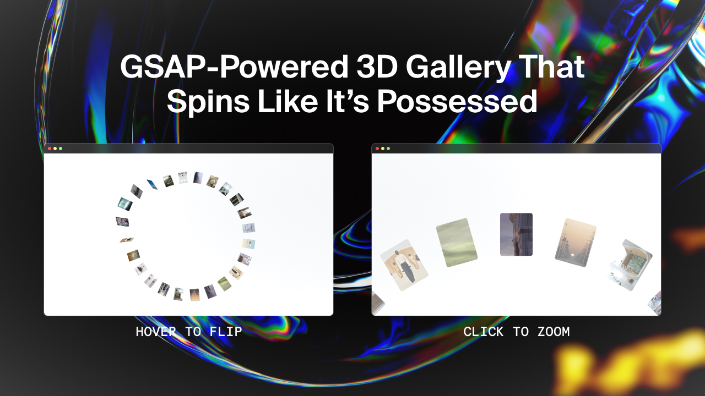

# Frontend Codebase Analysis: CG 3D Circular Image Gallery

<div align="center">
  <br />
  
  <br />
  <br />

  <div>
    
    
    
    
    
  </div>

  <h3 align="center">CG 3D Circular Image Gallery — Interactive 3D Gallery</h3>
  <p align="center">An advanced 3D circular image gallery with mouse-following rotation, scroll-triggered spinning, and interactive hover effects.</p>
</div>

## 🖼 Project Showcase

This project demonstrates an advanced 3D circular image gallery system that creates an immersive interactive experience. The main scenario involves a circular arrangement of 150 image items that respond to mouse movement with 3D rotation, scroll-triggered spinning animations, and hover effects that preview images in the center. The tech stack solves complex 3D transformations, smooth animations, and interactive user experience through GSAP's advanced features, ScrollTrigger for scroll-based animations, and CSS 3D transforms.

## 📁 Project Structure

```
cg-3d-circular-img-gallery/
├── index.html              # Main HTML structure with navigation and gallery
├── script.js               # Core 3D animation logic and interaction handling
├── styles.css              # Styling with 3D transforms and responsive design
├── assets/                 # Image assets
│   ├── CG18052025.jpg     # Project showcase image
│   ├── img1.jpg           # Gallery image 1
│   ├── img2.jpg           # Gallery image 2
│   ├── ...                # Additional gallery images
│   └── img15.jpg          # Gallery image 15 (repeated for 150 items)
├── package-lock.json       # Lock file (no dependencies)
└── README.md              # Project documentation
```

## 🛠 Technology Stack

| Technology | Version | Purpose |
|------------|---------|---------|
| **GSAP** | 3.12.3 | Advanced animation library for smooth 3D transitions and complex effects |
| **ScrollTrigger** | 3.12.3 | Scroll-based animation triggers for gallery spinning |
| **HTML5** | - | Semantic structure with navigation and gallery layout |
| **CSS3** | - | Styling with 3D transforms, perspective, and modern properties |
| **JavaScript** | ES6+ | Interactive logic, mouse tracking, and animation orchestration |

## 🏗 Architecture

### Core Animation System
- **3D Circular Layout**: 150 items arranged in a perfect circle with calculated angles
- **Mouse-Following Rotation**: Real-time 3D rotation based on mouse position
- **Scroll-Triggered Spinning**: Continuous rotation based on scroll progress
- **Interactive Hover Effects**: Preview system with 3D item transformations

### Key Patterns
```javascript
// 3D circular positioning
items.forEach((item, index) => {
  gsap.set(item, {
    rotationY: 90,
    rotationZ: index * angleIncrement - 90,
    transformOrigin: "50% 400px",
  });
});

// Mouse-following rotation
document.addEventListener("mousemove", function (event) {
  const percentX = (x - centerX) / centerX;
  const percentY = (y - centerY) / centerY;
  const rotateX = 55 + percentY * 2;
  const rotateY = percentX * 2;
  
  gsap.to(gallery, {
    duration: 1,
    ease: "power2.out",
    rotateX: rotateX,
    rotateY: rotateY,
  });
});

// Scroll-triggered spinning
ScrollTrigger.create({
  trigger: "body",
  start: "top top",
  end: "bottom bottom",
  scrub: 2,
  onUpdate: (self) => {
    const rotationProgress = self.progress * 360;
    // Update each item's rotation
  }
});
```

## 🎨 UI and Styling

### Design System
- **Typography**: "Circular Std" for clean, modern readability
- **Color Palette**: White background with black text and gray image frames
- **Layout**: Full-screen 3D gallery with fixed navigation and footer

### Key CSS Features
```css
/* 3D perspective and transforms */
.container {
  perspective: 1500px;
}

.gallery {
  transform-style: preserve-3d;
  transform: translateX(-50%) rotateX(55deg);
}

/* Individual gallery items */
.item {
  position: absolute;
  width: 45px;
  height: 60px;
  background: #b0b0b0;
  transform-style: preserve-3d;
}

/* Preview image positioning */
.preview-img {
  position: fixed;
  top: 50%;
  left: 50%;
  transform: translate(-50%, -50%);
  width: 300px;
  height: 200px;
  z-index: 0;
}
```

### Responsive Design
- Full-screen layout optimized for desktop experience
- Fixed navigation and footer for consistent UI
- 3D transforms that work across modern browsers

## ✅ Code Quality

### Strengths
- **Advanced 3D Logic**: Sophisticated circular positioning and rotation system
- **Performance Optimized**: Efficient GSAP animations with proper easing
- **Clean Architecture**: Separated concerns between HTML, CSS, and JavaScript
- **Interactive Experience**: Smooth mouse tracking and hover effects

### Areas for Improvement
- **Error Handling**: Could benefit from try-catch blocks for animation failures
- **Accessibility**: Missing ARIA labels and keyboard navigation
- **Performance**: Could implement intersection observer for better performance
- **Mobile Support**: Currently desktop-only experience

## 🔧 Key Modules

### 1. 3D Gallery Controller (`script.js`)
- **Purpose**: Manages all 3D animations and interactions
- **Key Functions**: Mouse tracking, item positioning, rotation calculations
- **API**: Handles 3D transforms, scroll triggers, and hover effects

### 2. Circular Layout System (`script.js`)
- **Purpose**: Creates and positions 150 items in perfect circle
- **Key Features**: Angle calculations, 3D positioning, image cycling
- **API**: Dynamic item creation with mathematical positioning

### 3. Mouse Interaction System (`script.js`)
- **Purpose**: Handles mouse movement and 3D rotation
- **Key Features**: Real-time tracking, smooth interpolation, 3D transforms
- **API**: Mouse event handling with GSAP animations

### 4. Scroll Animation System (`script.js`)
- **Purpose**: Manages scroll-triggered gallery spinning
- **Key Features**: Progress tracking, continuous rotation, smooth transitions
- **API**: ScrollTrigger integration with 3D rotation updates

## 🌟 Best Practices

### Animation Performance
- **GSAP Optimization**: Using `power2.out` and `power3.out` easing for smooth transitions
- **3D Transforms**: Efficient CSS 3D transforms with `transform-style: preserve-3d`
- **Animation Queuing**: Proper overwrite handling to prevent conflicts

### Code Organization
- **Mathematical Calculations**: Clean angle and positioning calculations
- **Event Handling**: Organized mouse and scroll event management
- **3D Perspective**: Proper perspective and transform-origin settings

### User Experience
- **Smooth Interactions**: Fluid mouse tracking with interpolated movement
- **Visual Feedback**: Clear hover effects and preview system
- **Immersive Design**: Full-screen 3D experience with engaging animations

## 🚀 Infrastructure

### Development Setup
- **No Build Process**: Pure HTML/CSS/JS implementation
- **CDN Dependencies**: GSAP and ScrollTrigger loaded from CDN
- **Local Assets**: 15 unique images repeated for 150 gallery items

### Performance Considerations
- **Image Optimization**: Efficient image cycling and loading
- **Animation Efficiency**: GSAP's optimized 3D animation engine
- **Memory Management**: Proper event listener cleanup

## 📋 Conclusions and Recommendations

### Strengths
- **Advanced 3D Animations**: Sophisticated circular layout and rotation system
- **Smooth Performance**: Well-optimized GSAP animations with 3D transforms
- **Interactive Design**: Engaging mouse-following and hover effects
- **Immersive Experience**: Full-screen 3D gallery with scroll integration

### Recommendations for Enhancement
1. **Add Mobile Support**: Implement touch gestures and responsive 3D scaling
2. **Improve Accessibility**: Add ARIA labels and keyboard navigation
3. **Performance Monitoring**: Add performance metrics for 3D animation timing
4. **Error Handling**: Implement try-catch blocks for animation failures
5. **Testing**: Add unit tests for 3D positioning and rotation logic

### Use Cases
- **Portfolio Galleries**: Perfect for showcasing creative work in 3D
- **Interactive Exhibitions**: Ideal for immersive digital art displays
- **Product Showcases**: Great for 3D product presentations
- **Creative Interfaces**: Suitable for cutting-edge web experiences

This project demonstrates excellent use of modern web technologies to create engaging, 3D interactive experiences with smooth animations and professional-grade user interfaces.
