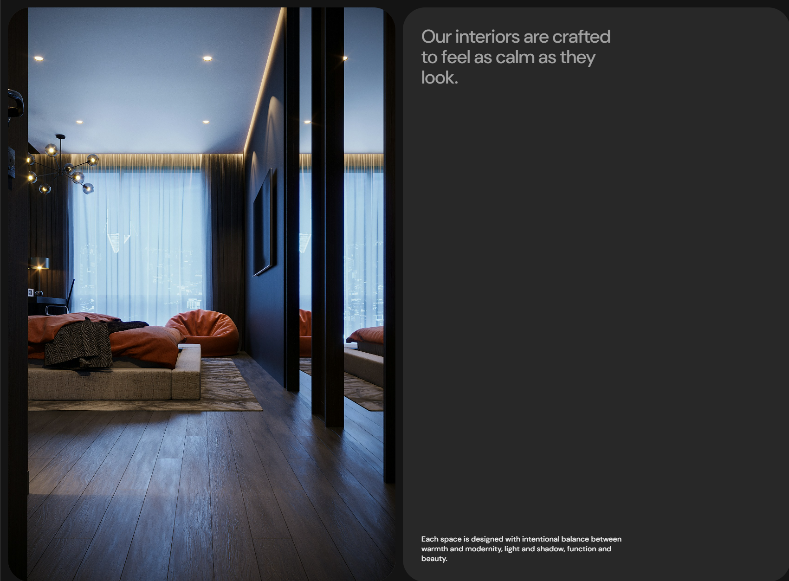
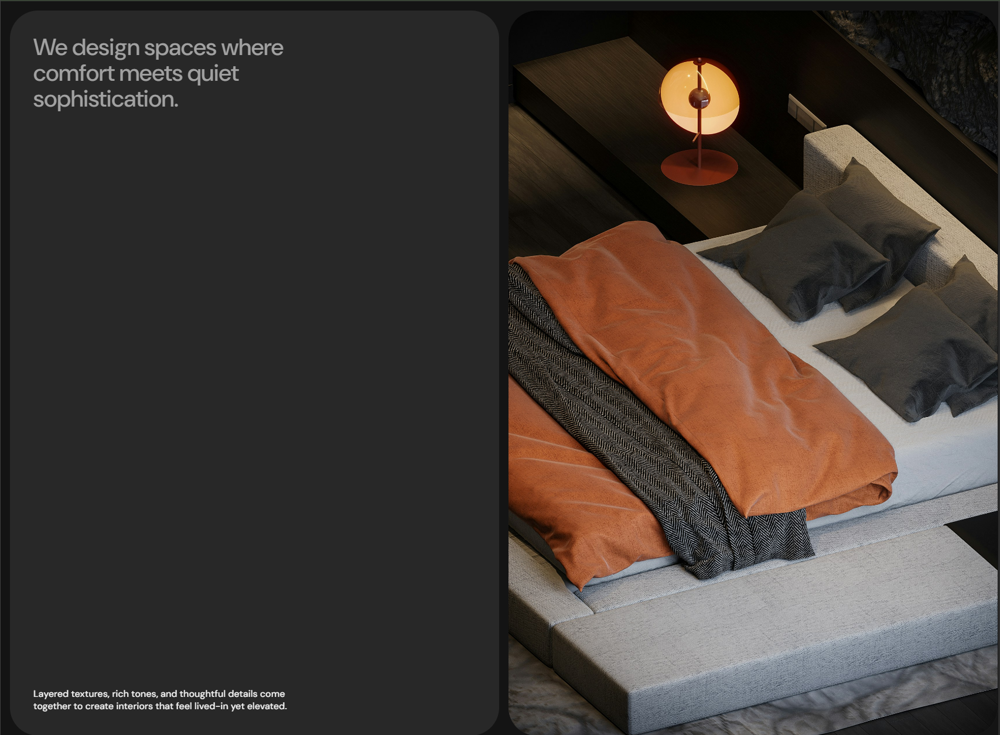

# Frontend Codebase Analysis: CG Capsules Animated Columns

<div align="center">
  <br />
  
  
  <br />
  <br />

  <div>
    
    
    
    
    
    
    
  </div>

  <h3 align="center">CG Capsules Animated Columns — Interior Design Showcase</h3>
  <p align="center">An advanced scroll-triggered animation system with sophisticated column transitions, text reveals, and smooth scrolling.</p>
</div>

## 🖼 Project Showcase

This project demonstrates an advanced scroll-triggered animation system that creates a sophisticated "capsule-style" column layout for interior design content. The main scenario involves a multi-phase scroll experience where columns transition, images scale and reveal, and text content animates in sequence. The tech stack solves complex scroll-based animations, smooth transitions, and immersive storytelling through GSAP's ScrollTrigger, SplitText for line-by-line animations, and Lenis for buttery-smooth scrolling.

## 📁 Project Structure

```
cg-capsules-animated-columns/
├── index.html              # Main HTML structure with intro, columns, and outro
├── script.js               # Core animation logic with scroll triggers and phase management
├── styles.css              # Styling with capsule design, responsive layout, and animations
├── public/                 # Static assets
│   ├── img_01.jpg         # Interior design image 1
│   ├── img_02.jpg         # Interior design image 2
│   └── img_03.jpg         # Interior design image 3
├── package.json            # Dependencies and build configuration
└── README.md              # Project documentation
```

## 🛠 Technology Stack

| Technology | Version | Purpose |
|------------|---------|---------|
| **GSAP** | 3.13.0 | Advanced animation library for smooth transitions and complex effects |
| **ScrollTrigger** | 3.13.0 | Scroll-based animation triggers and progress tracking |
| **SplitText** | 3.13.0 | Text splitting for line-by-line animations |
| **Lenis** | 1.3.4 | Smooth scrolling library for enhanced user experience |
| **Vite** | 7.0.0 | Modern build tool and development server |
| **HTML5** | - | Semantic structure with section-based layout |
| **CSS3** | - | Styling with capsule design, responsive layout, and modern properties |

## 🏗 Architecture

### Core Animation System
- **Multi-Phase Scroll Triggers**: Three distinct animation phases based on scroll progress
- **Column State Management**: Dynamic positioning and opacity changes for each column
- **Text Line Animations**: SplitText integration for sophisticated text reveals
- **Smooth Scrolling**: Lenis integration for enhanced scroll experience

### Key Patterns
```javascript
// Multi-phase scroll animation system
ScrollTrigger.create({
  trigger: ".sticky-cols",
  start: "top top",
  end: `+=${window.innerHeight * 6}px`,
  onUpdate: (self) => {
    const progress = self.progress;
    
    if (progress >= 0.33 && currentPhase === 0) {
      currentPhase = 1;
      // Phase 1 animations
    }
    
    if (progress >= 0.66 && currentPhase === 1) {
      currentPhase = 2;
      // Phase 2 animations
    }
  }
});

// Text splitting for line animations
const split = new SplitText(element, {
  type: "lines",
  linesClass: "line",
});
```

## 🎨 UI and Styling

### Design System
- **Typography**: "DM Sans" for clean, modern readability
- **Color Palette**: Dark theme with `--bg: #141414`, `--bg-200: #282828`, `--fg: #fff`
- **Layout**: Capsule-style columns with rounded corners and sophisticated spacing

### Key CSS Features
```css
/* Capsule design with rounded corners */
.col-content-wrapper,
.col-img-wrapper {
  background-color: var(--bg-200);
  border-radius: 3rem;
  overflow: hidden;
}

/* Multi-column positioning system */
.col-2 { transform: translateX(100%); }
.col-3 { transform: translateX(100%) translateY(100%); }
.col-4 { transform: translateX(100%) translateY(100%); }

/* Clip-path animations for image reveals */
.col-img-2 {
  clip-path: polygon(0% 0%, 100% 0%, 100% 0%, 0% 0%);
}
```

### Responsive Design
- Mobile-first approach with simplified typography
- Responsive font sizes and spacing adjustments
- Maintained functionality across all device sizes

## ✅ Code Quality

### Strengths
- **Sophisticated Animation Logic**: Well-structured multi-phase scroll system
- **Performance Optimized**: Efficient scroll event handling and animation queuing
- **Clean Architecture**: Separated concerns between HTML, CSS, and JavaScript
- **Smooth User Experience**: Lenis integration for enhanced scrolling

### Areas for Improvement
- **Error Handling**: Could benefit from try-catch blocks for animation failures
- **Accessibility**: Missing ARIA labels and keyboard navigation
- **Performance**: Could implement intersection observer for better performance

## 🔧 Key Modules

### 1. Scroll Animation Controller (`script.js`)
- **Purpose**: Manages all scroll-triggered animations and phase transitions
- **Key Functions**: Phase management, progress tracking, animation sequencing
- **API**: Handles column transitions, image scaling, and text reveals

### 2. Text Animation System (`script.js`)
- **Purpose**: Manages SplitText integration and line-by-line animations
- **Key Features**: Text splitting, line animations, content swapping
- **API**: `initTextSplit()`, line positioning, and animation triggers

### 3. Column Layout System (`styles.css`)
- **Purpose**: Defines capsule-style column positioning and transitions
- **Key Features**: Multi-column layout, responsive design, capsule styling
- **API**: CSS classes for different column states and animations

### 4. Smooth Scrolling Integration (`script.js`)
- **Purpose**: Enhances scroll experience with Lenis smooth scrolling
- **Key Features**: Smooth scroll behavior, ScrollTrigger integration
- **API**: Lenis instance with GSAP ticker integration

## 🌟 Best Practices

### Animation Performance
- **ScrollTrigger Optimization**: Efficient progress tracking and phase management
- **Smooth Transitions**: Consistent 0.75s duration for all animations
- **State Management**: Proper phase tracking to prevent animation conflicts

### Code Organization
- **Modular Functions**: Separated text splitting and animation logic
- **Clean Event Handling**: Organized scroll event management
- **Responsive Design**: Mobile-first approach with proper breakpoints

### User Experience
- **Smooth Scrolling**: Lenis integration for enhanced scroll feel
- **Visual Feedback**: Clear phase transitions and content reveals
- **Responsive Design**: Optimized experience across all devices

## 🚀 Infrastructure

### Development Setup
- **Vite Build System**: Modern development server with hot reload
- **ES6 Modules**: Clean import/export structure
- **Local Assets**: Optimized images for fast loading

### Performance Considerations
- **Image Optimization**: Proper sizing and format for web delivery
- **Animation Efficiency**: GSAP's optimized animation engine
- **Scroll Performance**: Lenis smooth scrolling with proper integration

## 📋 Conclusions and Recommendations

### Strengths
- **Advanced Scroll Animations**: Sophisticated multi-phase scroll system
- **Smooth Performance**: Well-optimized GSAP animations with Lenis
- **Clean Design**: Professional capsule-style layout
- **Responsive Design**: Works well across different screen sizes

### Recommendations for Enhancement
1. **Add Error Handling**: Implement try-catch blocks for animation failures
2. **Improve Accessibility**: Add ARIA labels and keyboard navigation
3. **Performance Monitoring**: Add performance metrics for scroll timing
4. **Code Splitting**: Consider modularizing animation functions
5. **Testing**: Add unit tests for scroll logic and phase management

### Use Cases
- **Interior Design Showcases**: Perfect for design portfolio presentations
- **Brand Storytelling**: Ideal for immersive brand experiences
- **Product Presentations**: Great for sophisticated product showcases
- **Content Narratives**: Suitable for any scroll-based storytelling

This project demonstrates excellent use of modern web technologies to create engaging, scroll-based experiences with smooth animations and professional-grade user interfaces.
