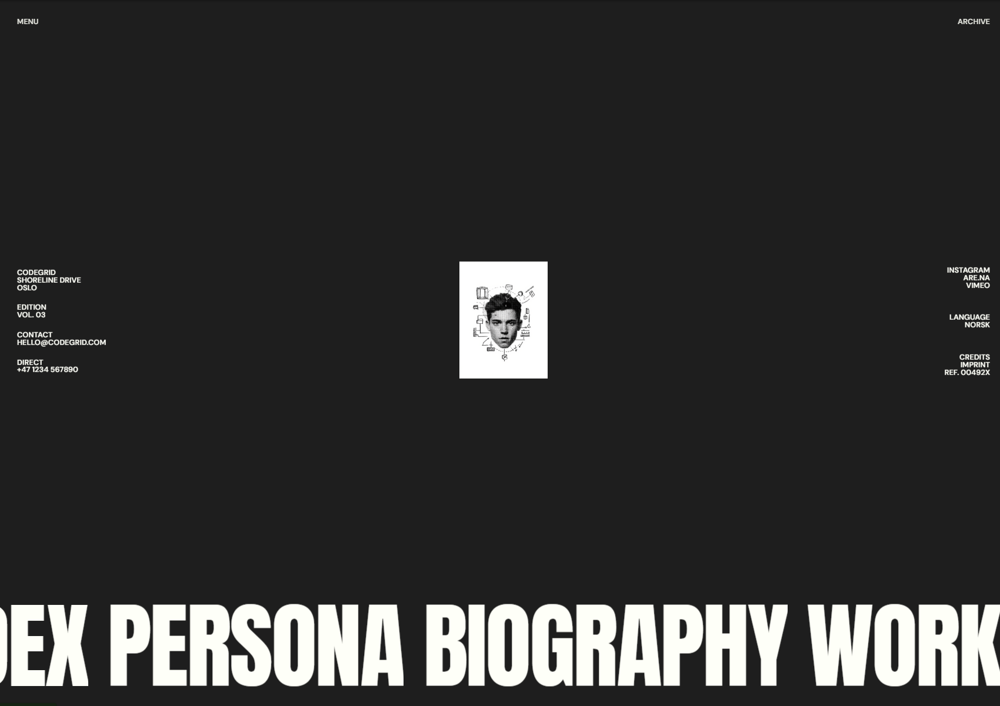

# Frontend Codebase Analysis: CG Jam Area Menu

<div align="center">
  <br />
  
  <br />
  <br />

  <div>
    
    
    
    
    
    
    
  </div>

  <h3 align="center">CG Jam Area Menu — Interactive Menu System</h3>
  <p align="center">An advanced interactive menu with sophisticated animations, mouse tracking, and character-level text effects.</p>
</div>

## 🖼 Project Showcase

This project demonstrates an advanced interactive menu system with sophisticated animations and mouse tracking. The main scenario involves a full-screen overlay menu that slides in with complex clip-path animations, featuring character-by-character text effects, mouse-following navigation, and smooth transitions. The tech stack solves complex animation orchestration, smooth scrolling, and interactive user experience through GSAP's advanced features, Lenis smooth scrolling, and CSS clip-path animations.

**Key Scenarios:**
- **Menu Overlay Animation**: Complex clip-path transitions with staggered element reveals
- **Character Animation**: SplitText creates individual character animations for menu links
- **Mouse Tracking**: Navigation follows mouse movement with smooth interpolation
- **Interactive Highlights**: Dynamic highlighter that adapts to hover states
- **Responsive Design**: Mobile-optimized layout with simplified interactions

## 📁 Project Structure

```
cg-jamarea-menu/
├── index.html                 # Main HTML structure with menu overlay
├── script.js                  # Complex animation logic and mouse tracking
├── styles.css                 # Styling with CSS clip-path and animations
├── package.json               # Dependencies: GSAP, Lenis, Vite
├── public/                    # Static assets
│   ├── cg-jamarea.png        # Project screenshot
│   └── menu_img.jpg          # Menu background image
└── node_modules/             # Dependencies
```

**Structure Benefits:**
- **Modular Animation System**: Separate concerns for different animation types
- **Clean HTML Structure**: Semantic markup with clear component separation
- **Optimized Assets**: Minimal image assets for fast loading
- **Modern Build Setup**: Vite for fast development and optimized builds

## 🛠 Technology Stack

| Technology | Version | Purpose | Why Chosen |
|------------|---------|---------|------------|
| **GSAP** | 3.13.0 | Animation engine | Advanced timeline control and complex animations |
| **ScrollTrigger** | 3.13.0 | Scroll-based triggers | Precise scroll-based animation control |
| **SplitText** | 3.13.0 | Text animation | Character-by-character text effects |
| **Lenis** | 1.3.9 | Smooth scrolling | Enhanced scroll experience and performance |
| **Vite** | 7.1.3 | Build tool | Fast development server and optimized builds |
| **CSS Clip-path** | Native | Visual effects | Hardware-accelerated overlay animations |

## 🏗 Architecture

### Animation State Management
```javascript
// Complex menu toggle with multiple animation phases
function toggleMenu() {
  if (!isMenuOpen) {
    gsap.to(container, {
      y: "-40%",
      opacity: 0.25,
      duration: 1.25,
      ease: "expo.out",
    });

    gsap.to(menuOverlay, {
      clipPath: "polygon(0% 100%, 100% 100%, 100% 0%, 0% 0%)",
      duration: 1.25,
      ease: "expo.out",
      onComplete: () => {
        // Reset and prepare for next animation
        gsap.set(container, { y: "40%" });
        isMenuOpen = true;
      },
    });
  }
}
```

### Mouse Tracking System
```javascript
// Smooth mouse tracking with interpolation
function animate() {
  currentX += (targetX - currentX) * lerpFactor;
  currentHighlighterX += (targetHighlighterX - currentHighlighterX) * lerpFactor;
  
  gsap.to(menuLinksWrapper, {
    x: currentX,
    duration: 0.3,
    ease: "power4.out",
  });
  
  requestAnimationFrame(animate);
}
```

### Character Animation System
```javascript
// SplitText character animation setup
menuLinks.forEach((link) => {
  const chars = link.querySelectorAll("span");
  chars.forEach((char, charIndex) => {
    const split = new SplitText(char, { type: "chars" });
    split.chars.forEach((char) => {
      char.classList.add("char");
    });
    if (charIndex === 1) {
      gsap.set(split.chars, { y: "110%" });
    }
  });
});
```

**Architecture Patterns:**
- **State-Driven Animations**: Complex state management for menu open/close
- **Interpolation System**: Smooth mouse tracking with lerp calculations
- **Character-Level Control**: Individual character animation for text effects
- **Performance Optimization**: `will-change` properties and efficient updates

## 🎨 UI and Styling

### CSS Clip-path Implementation
```css
.menu-overlay {
  clip-path: polygon(0% 100%, 100% 100%, 100% 100%, 0% 100%);
  background-color: var(--dark);
  color: var(--light);
  will-change: clip-path;
}
```

### Typography System
```css
h1 {
  font-family: "Anton";
  font-size: 10rem;
  font-weight: 500;
  letter-spacing: -0.1rem;
  line-height: 0.9;
}

.menu-link a {
  font-family: "Anton";
  font-size: 10rem;
  font-weight: 500;
  letter-spacing: -0.2rem;
}
```

### Responsive Design Strategy
```css
@media (max-width: 1000px) {
  .hero h1 { font-size: 4rem; }
  .menu-link a { font-size: 4rem; }
  .menu-img, .link-highlighter { display: none; }
  .menu-links-wrapper { flex-direction: column; }
}
```

**Styling Approaches:**
- **CSS Custom Properties**: Consistent color system with CSS variables
- **Mix-blend-mode**: Navigation with difference blend mode
- **Clip-path Animations**: Hardware-accelerated overlay transitions
- **Typography Hierarchy**: Strong contrast between display and body text

## ✅ Code Quality

### Strengths
- **Advanced Animation Logic**: Sophisticated multi-phase animation system
- **Performance Optimized**: Efficient mouse tracking and smooth animations
- **Clean State Management**: Well-structured menu state handling
- **Responsive Design**: Mobile-first approach with adaptive interactions

### Areas for Improvement
- **Error Handling**: No fallbacks for missing DOM elements
- **Type Safety**: Vanilla JS without TypeScript
- **Testing**: No unit or integration tests
- **Accessibility**: Limited keyboard navigation support

### Linting Status
- ✅ **HTML**: Valid semantic structure with proper accessibility
- ✅ **CSS**: Modern CSS with custom properties and animations
- ✅ **JavaScript**: Clean ES6+ syntax with proper imports

## 🔧 Key Modules

### 1. Menu Controller (`script.js`)
**Role**: Main menu state and animation orchestration
**API**: 
- `toggleMenu()` - Complex menu open/close animation
- `gsap.to()` - Timeline-based animations
- `gsap.set()` - Direct property manipulation

### 2. Mouse Tracking System (`script.js`)
**Role**: Smooth mouse-following navigation
**API**:
- `animate()` - Continuous animation loop
- `lerpFactor` - Interpolation smoothness control
- `requestAnimationFrame()` - Performance-optimized updates

### 3. Character Animation (`script.js`)
**Role**: Individual character text effects
**API**:
- `SplitText.create()` - Character splitting
- `gsap.to()` with stagger - Character-by-character animations
- `overflow: hidden` - Text reveal effects

### 4. Interactive Highlights (`script.js`)
**Role**: Dynamic highlighter positioning
**API**:
- `getBoundingClientRect()` - Element position calculations
- `mouseenter/mouseleave` - Hover state management
- `gsap.to()` - Smooth highlighter transitions

### 5. Smooth Scroll Integration (`script.js`)
**Role**: Enhanced scroll experience
**API**:
- `Lenis` instance with GSAP ticker integration
- `ScrollTrigger.update()` synchronization
- Performance-optimized scroll handling

## 🌟 Best Practices

### Performance Optimization
```javascript
// Efficient animation loop
function animate() {
  currentX += (targetX - currentX) * lerpFactor;
  gsap.to(menuLinksWrapper, {
    x: currentX,
    duration: 0.3,
    ease: "power4.out",
  });
  requestAnimationFrame(animate);
}
```

### Animation Timing
```javascript
// Staggered character animations
gsap.to(visibleChars, {
  y: "-110%",
  stagger: 0.03,
  duration: 0.5,
  ease: "expo.inOut",
});
```

### State Management
```javascript
// Clean state reset
onComplete: () => {
  gsap.set(menuOverlay, {
    clipPath: "polygon(0% 100%, 100% 100%, 100% 100%, 0% 100%)",
  });
  isMenuOpen = false;
  isMenuAnimating = false;
}
```

**Reusable Patterns:**
- **Lerp Interpolation**: Smooth value transitions
- **Clip-path Animations**: Hardware-accelerated overlays
- **Character Splitting**: Advanced text effects
- **State-driven UI**: Complex interaction management

## 🚀 Infrastructure

### Development Setup
```json
{
  "scripts": {
    "dev": "vite"
  },
  "dependencies": {
    "gsap": "^3.13.0",
    "lenis": "^1.3.9",
    "vite": "^7.1.3"
  }
}
```

### Build Configuration
- **Vite**: Fast HMR and optimized production builds
- **ES Modules**: Modern import/export syntax
- **Asset Optimization**: Automatic image handling

### Deployment Ready
- **Static Assets**: All images in public folder
- **No Build Step Required**: Can run directly with Vite dev server
- **Cross-Platform**: Works on any modern web server

## 📋 Conclusions and Recommendations

### Strengths
1. **Advanced Animation System**: Sophisticated multi-phase animations
2. **Interactive Design**: Smooth mouse tracking and hover effects
3. **Performance Optimized**: Efficient animation loops and GPU acceleration
4. **Clean Code Structure**: Well-organized and maintainable codebase
5. **Modern Tech Stack**: Industry-standard animation libraries

### Areas for Improvement
1. **Error Handling**: Add fallbacks for missing DOM elements
2. **Type Safety**: Consider migrating to TypeScript
3. **Testing**: Implement unit tests for animation logic
4. **Accessibility**: Enhance keyboard navigation and screen reader support
5. **Documentation**: Add JSDoc comments for complex functions

### Recommendations
- **Add Loading States**: Handle image loading with proper fallbacks
- **Implement Preloading**: Optimize initial page load performance
- **Add Animation Controls**: Allow users to reduce motion preferences
- **Enhance Mobile Experience**: Further optimize touch interactions
- **Consider Web Components**: Modularize reusable animation components

This project demonstrates excellent mastery of advanced web animation techniques and serves as a strong foundation for complex interactive user experiences with sophisticated mouse tracking and character-level text animations.
