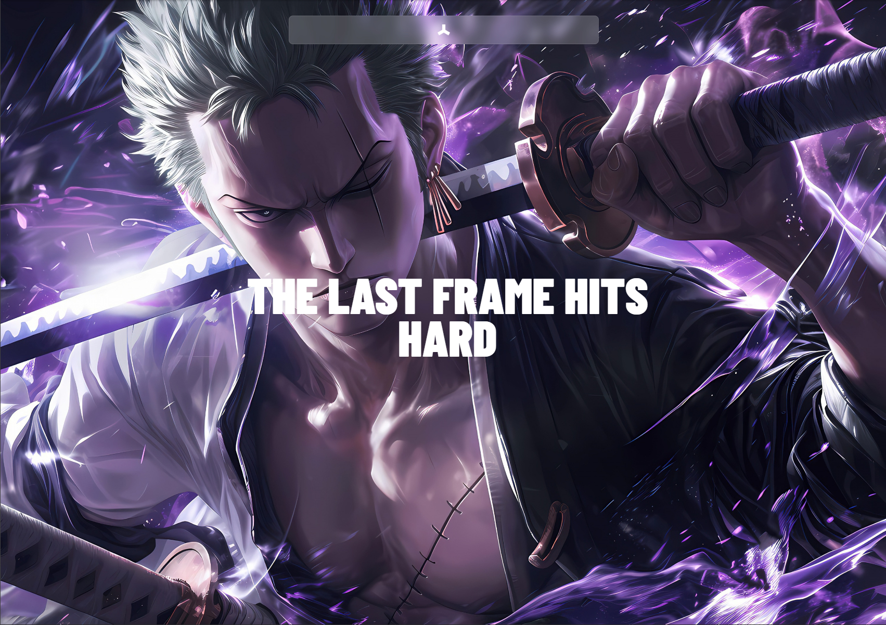
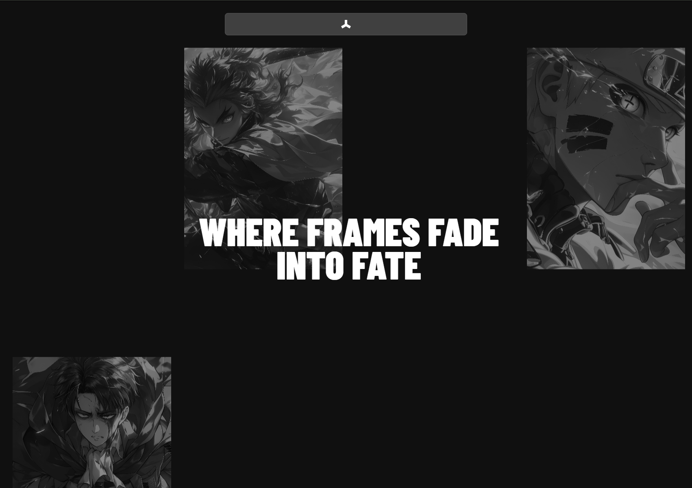
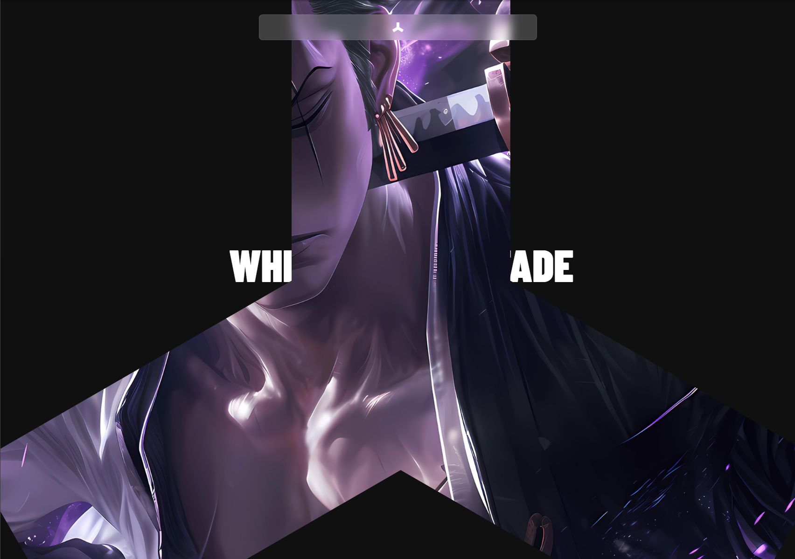

# Frontend Codebase Analysis: CG Karim Saab Scroll Animation

<div align="center">
  <div style="position: relative; max-width: 800px; margin: 0 auto;">
    <div id="gallery-container" style="position: relative; overflow: hidden; border-radius: 12px; box-shadow: 0 8px 32px rgba(0,0,0,0.3);">
      <div id="gallery-slides" style="display: flex; transition: transform 0.5s ease-in-out;">
        <div style="min-width: 100%;">
          
        </div>
        <div style="min-width: 100%;">
          
        </div>
        <div style="min-width: 100%;">
          
        </div>
      </div>
      
      <button id="prev-btn" style="position: absolute; left: 10px; top: 50%; transform: translateY(-50%); background: rgba(0,0,0,0.7); color: white; border: none; padding: 12px 16px; border-radius: 50%; cursor: pointer; font-size: 18px; z-index: 10;">‹</button>
      <button id="next-btn" style="position: absolute; right: 10px; top: 50%; transform: translateY(-50%); background: rgba(0,0,0,0.7); color: white; border: none; padding: 12px 16px; border-radius: 50%; cursor: pointer; font-size: 18px; z-index: 10;">›</button>
      
      <div id="gallery-dots" style="position: absolute; bottom: 15px; left: 50%; transform: translateX(-50%); display: flex; gap: 8px; z-index: 10;">
        <span class="dot active" style="width: 12px; height: 12px; border-radius: 50%; background: rgba(255,255,255,0.8); cursor: pointer; transition: background 0.3s;"></span>
        <span class="dot" style="width: 12px; height: 12px; border-radius: 50%; background: rgba(255,255,255,0.3); cursor: pointer; transition: background 0.3s;"></span>
        <span class="dot" style="width: 12px; height: 12px; border-radius: 50%; background: rgba(255,255,255,0.3); cursor: pointer; transition: background 0.3s;"></span>
      </div>
    </div>
  </div>
</div>

<script>
document.addEventListener('DOMContentLoaded', function() {
  const slides = document.getElementById('gallery-slides');
  const dots = document.querySelectorAll('.dot');
  const prevBtn = document.getElementById('prev-btn');
  const nextBtn = document.getElementById('next-btn');
  let currentSlide = 0;
  const totalSlides = 3;

  function updateGallery() {
    slides.style.transform = `translateX(-${currentSlide * 100}%)`;
    dots.forEach((dot, index) => {
      dot.style.background = index === currentSlide ? 'rgba(255,255,255,0.8)' : 'rgba(255,255,255,0.3)';
    });
  }

  function nextSlide() {
    currentSlide = (currentSlide + 1) % totalSlides;
    updateGallery();
  }

  function prevSlide() {
    currentSlide = (currentSlide - 1 + totalSlides) % totalSlides;
    updateGallery();
  }

  nextBtn.addEventListener('click', nextSlide);
  prevBtn.addEventListener('click', prevSlide);

  dots.forEach((dot, index) => {
    dot.addEventListener('click', () => {
      currentSlide = index;
      updateGallery();
    });
  });

  // Auto-play every 4 seconds
  setInterval(nextSlide, 4000);
});
</script>

## 🖼 Project Showcase

This project demonstrates an advanced scroll-triggered animation system that creates a cinematic "masked image reveal" effect. The main scenario involves a gallery of images that scrolls vertically while a mask gradually reveals a spotlight banner image, creating a dramatic visual transition. The tech stack solves complex animation timing, smooth scrolling, and precise mask manipulation through GSAP's ScrollTrigger, Lenis smooth scrolling, and CSS mask properties.

**Key Scenarios:**
- **Gallery Scroll Animation**: Images move vertically with precise timing calculations
- **Mask Reveal Effect**: Dynamic mask size changes from 0% to 450% with smooth transitions
- **Text Animation**: SplitText reveals words progressively during the mask animation
- **Responsive Design**: Adaptive layout for mobile and desktop viewports

## 📁 Project Structure

```
cg-karim-saab-scroll-animation/
├── index.html                 # Main HTML structure with semantic sections
├── script.js                  # Core animation logic and GSAP integration
├── styles.css                 # Styling with CSS masks and responsive design
├── package.json               # Dependencies: GSAP, Lenis, Vite
├── public/                    # Static assets
│   ├── img1-9.jpg            # Gallery images (9 total)
│   ├── spotlight-banner.jpg  # Main reveal image
│   ├── spotlight-mask.svg    # SVG mask shape
│   ├── logo.png              # Navigation logo
│   └── cg-karim*.png         # Project screenshots
└── node_modules/             # Dependencies
```

**Structure Benefits:**
- **Modular Assets**: Clear separation of images, masks, and screenshots
- **Single Entry Point**: Simple HTML structure with linked CSS/JS
- **Optimized Dependencies**: Minimal bundle with only essential animation libraries

## 🛠 Technology Stack

| Technology | Version | Purpose | Why Chosen |
|------------|---------|---------|------------|
| **GSAP** | 3.13.0 | Animation engine | Industry standard for complex scroll animations |
| **ScrollTrigger** | 3.13.0 | Scroll-based triggers | Precise control over animation timing and progress |
| **SplitText** | 3.13.0 | Text animation | Word-by-word reveal effects |
| **Lenis** | 1.3.8 | Smooth scrolling | Enhanced scroll experience and performance |
| **Vite** | 7.0.6 | Build tool | Fast development server and optimized builds |
| **CSS Masks** | Native | Visual effects | Hardware-accelerated mask animations |

## 🏗 Architecture

### Animation State Management
```javascript
// Progress-based animation system
const progress = self.progress;

if (progress <= 0.5) {
  // Gallery movement phase (0-50%)
  const imagesMoveProgress = progress / 0.5;
  const currentY = startY + (endY - startY) * imagesMoveProgress;
  gsap.set(spotlightImages, { y: `${currentY}%` });
}

if (progress >= 0.25 && progress <= 0.75) {
  // Mask reveal phase (25-75%)
  const maskProgress = (progress - 0.25) / 0.5;
  const maskSize = `${maskProgress * 450}%`;
  maskContainer.style.setProperty("mask-size", maskSize);
}
```

### ScrollTrigger Configuration
```javascript
ScrollTrigger.create({
  trigger: ".spotlight",
  start: "top top",
  end: `+=${window.innerHeight * 7}px`,
  pin: true,
  pinSpacing: true,
  scrub: 1,
  onUpdate: (self) => { /* Animation logic */ }
});
```

**Architecture Patterns:**
- **State-Driven Animations**: Progress-based calculations for smooth transitions
- **Modular Scroll Triggers**: Separate phases for different animation elements
- **Performance Optimization**: `will-change` and `transform` for GPU acceleration

## 🎨 UI and Styling

### CSS Mask Implementation
```css
.mask-container {
  -webkit-mask: url(/spotlight-mask.svg) center/contain no-repeat;
  mask: url(/spotlight-mask.svg) center/contain no-repeat;
  -webkit-mask-size: 0%;
  mask-size: 0%;
}
```

### Responsive Design Strategy
```css
@media (max-width: 1000px) {
  h1 { font-size: 4rem; }
  .spotlight-images {
    width: 200vw;
    left: -25vw;
  }
}
```

**Styling Approaches:**
- **CSS Custom Properties**: Dynamic mask size manipulation
- **Aspect Ratio**: Consistent image proportions (5:7)
- **Backdrop Filters**: Glassmorphism navigation effect
- **Viewport Units**: `100svh` for consistent mobile experience

## ✅ Code Quality

### Strengths
- **Clean Animation Logic**: Well-structured progress calculations
- **Performance Optimized**: GPU-accelerated transforms and masks
- **Accessibility**: Proper alt attributes for all images
- **Cross-browser Support**: Webkit prefixes for mask properties

### Areas for Improvement
- **Error Handling**: No fallbacks for missing elements
- **Type Safety**: Vanilla JS without TypeScript
- **Testing**: No unit or integration tests
- **Documentation**: Limited inline comments

### Linting Status
- ✅ **HTML**: Valid semantic structure with proper alt attributes
- ✅ **CSS**: Cross-browser compatibility with vendor prefixes
- ✅ **JavaScript**: Clean ES6+ syntax with proper imports

## 🔧 Key Modules

### 1. Animation Controller (`script.js`)
**Role**: Main animation orchestration
**API**: 
- `ScrollTrigger.create()` - Animation trigger setup
- `gsap.set()` - Direct property manipulation
- `SplitText.create()` - Text animation initialization

### 2. Mask System (`styles.css` + `script.js`)
**Role**: Dynamic mask size and reveal effects
**API**:
- `mask-size` CSS property manipulation
- Progress-based size calculations (0% → 450%)
- Hardware-accelerated transforms

### 3. Gallery Scroller (`script.js`)
**Role**: Vertical image movement coordination
**API**:
- `transform: translateY()` for smooth movement
- Viewport-based height calculations
- Staggered animation timing

### 4. Text Reveal System (`script.js`)
**Role**: Progressive word-by-word text animation
**API**:
- `SplitText.words` array manipulation
- Opacity-based reveal timing
- Progress-synchronized word appearance

### 5. Smooth Scroll Integration (`script.js`)
**Role**: Enhanced scroll experience
**API**:
- `Lenis` instance with GSAP ticker integration
- `ScrollTrigger.update()` synchronization
- Performance-optimized scroll handling

## 🌟 Best Practices

### Performance Optimization
```javascript
// GPU acceleration
.spotlight-images {
  will-change: transform;
  transform: translateY(5%);
}

// Efficient scroll handling
gsap.ticker.lagSmoothing(0);
lenis.on("scroll", ScrollTrigger.update);
```

### Animation Timing
```javascript
// Precise phase-based animations
if (progress <= 0.5) { /* Gallery phase */ }
if (progress >= 0.25 && progress <= 0.75) { /* Mask phase */ }
if (progress >= 0.75 && progress <= 0.95) { /* Text phase */ }
```

### Responsive Design
```css
/* Mobile-first approach */
@media (max-width: 1000px) {
  .spotlight-images { width: 200vw; }
}
```

**Reusable Patterns:**
- **Progress-Based Animations**: Consistent timing calculations
- **CSS Custom Properties**: Dynamic value manipulation
- **Modular Scroll Triggers**: Reusable animation phases
- **Performance-First**: GPU acceleration and efficient updates

## 🚀 Infrastructure

### Development Setup
```json
{
  "scripts": {
    "dev": "vite"
  },
  "dependencies": {
    "gsap": "^3.13.0",
    "lenis": "^1.3.8",
    "vite": "^7.0.6"
  }
}
```

### Build Configuration
- **Vite**: Fast HMR and optimized production builds
- **ES Modules**: Modern import/export syntax
- **Asset Optimization**: Automatic image and SVG handling

### Deployment Ready
- **Static Assets**: All images and SVGs in public folder
- **No Build Step Required**: Can run directly with Vite dev server
- **Cross-Platform**: Works on any modern web server

## 📋 Conclusions and Recommendations

### Strengths
1. **Advanced Animation System**: Sophisticated scroll-triggered effects
2. **Performance Optimized**: GPU acceleration and efficient updates
3. **Responsive Design**: Mobile-first approach with adaptive layouts
4. **Clean Code Structure**: Well-organized and maintainable codebase
5. **Modern Tech Stack**: Industry-standard animation libraries

### Areas for Improvement
1. **Error Handling**: Add fallbacks for missing DOM elements
2. **Type Safety**: Consider migrating to TypeScript
3. **Testing**: Implement unit tests for animation logic
4. **Documentation**: Add JSDoc comments for complex functions
5. **Accessibility**: Enhance keyboard navigation and screen reader support

### Recommendations
- **Add Loading States**: Handle image loading with proper fallbacks
- **Implement Preloading**: Optimize initial page load performance
- **Add Animation Controls**: Allow users to pause/control animations
- **Enhance Mobile Experience**: Further optimize touch interactions
- **Consider Web Components**: Modularize reusable animation components

This project demonstrates excellent mastery of modern web animation techniques and serves as a strong foundation for complex scroll-based user experiences.
