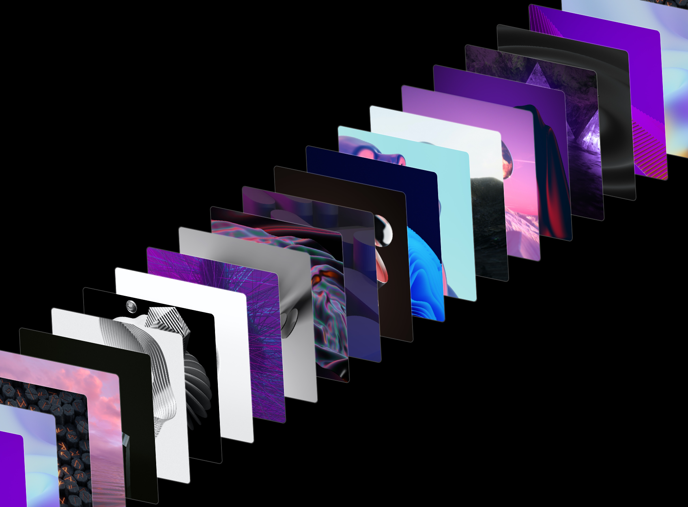

# Frontend Codebase Analysis: React Cards Gallery

<div align="center">
  <br />
  
  <br />
  <br />

  <div>
    
    
    
    
    
  </div>

  <h3 align="center">React Cards Gallery — 3D Scroll-Driven Image Experience</h3>
  <p align="center">An immersive 3D card gallery with scroll-triggered animations and interactive hover effects.</p>
</div>

## 🖼 Project Showcase

**React Cards Gallery** is an innovative web experience that demonstrates advanced 3D transformations and scroll-driven animations. The project creates a stunning visual gallery where 100 images are arranged in a 3D space, responding to scroll events with smooth transformations and interactive hover effects.

**Key Scenarios & Solutions:**
- **3D Card Layout**: CSS transforms create a complex 3D arrangement with realistic perspective
- **Scroll-Driven Animation**: JavaScript scroll handlers drive smooth 3D movement
- **Interactive Hover Effects**: Mouse events trigger smooth card positioning animations
- **Performance Optimization**: Fixed positioning and CSS transforms ensure smooth 60fps animations
- **Responsive 3D Space**: Viewport-based calculations maintain consistent 3D perspective

## 📁 Project Structure

```
cg-react-cards/
├── public/                    # Static assets
│   ├── cg-react-cards.png    # Project showcase image
│   └── vite.svg              # Vite logo
├── src/                       # Source code
│   ├── assets/               # Image assets (100+ images)
│   │   └── images/           # Gallery images (img1.jpg - img100.jpg)
│   ├── App.jsx               # Main React component
│   ├── App.css               # 3D styling and animations
│   ├── images.js             # Image import management
│   ├── main.jsx              # React entry point
│   └── index.css             # Global styles
├── package.json               # Dependencies and scripts
├── vite.config.js             # Vite build configuration
├── .eslintrc.cjs              # ESLint configuration
└── README.md                  # This documentation
```

**What Each File Solves:**
- `App.jsx`: Main React component with scroll handling and card rendering logic
- `App.css`: 3D transformations, card styling, and animation transitions
- `images.js`: Centralized image import management for 100+ gallery items
- `vite.config.js`: Modern build tooling for fast development experience
- `.eslintrc.cjs`: Code quality enforcement with React-specific rules

## 🛠 Technology Stack

| Technology | Version | Purpose |
|------------|---------|---------|
| **React** | 18.2.0 | Modern component-based UI library for interactive interfaces |
| **Vite** | 5.2.0 | Lightning-fast build tool and dev server with hot reload |
| **ESLint** | 8.57.0 | Code quality enforcement with React-specific plugins |
| **JavaScript** | ES6+ | Modern JavaScript features for scroll handling and DOM manipulation |
| **CSS3** | - | Advanced 3D transforms, transitions, and responsive design |

**Why This Stack:**
- **React**: Component-based architecture for maintainable card gallery
- **Vite**: Instant hot reload and optimized builds for smooth development
- **ESLint**: Ensures code quality and React best practices
- **CSS3 3D Transforms**: Hardware-accelerated 3D animations for smooth performance

## 🏗 Architecture

**Core Animation Pattern:**
```javascript
// Scroll-driven 3D transformation
const handleScroll = () => {
  const scrollPos = window.scrollY;
  const slider = document.querySelector(".slider");
  const initialTransform = `translate3d(-50%, -50%, 0) rotateX(0deg) rotateY(-25deg) rotateZ(-120deg)`;
  const zOffset = scrollPos * 0.5;
  slider.style.transform = `${initialTransform} translateY(${zOffset}px)`;
};
```

**State Management:**
- **Local Component State**: React useState manages card data array
- **Scroll Event Handling**: Native scroll events drive 3D transformations
- **Mouse Interaction**: Event handlers manage hover animations

**Key Architectural Decisions:**
- **Fixed Positioning**: Slider container uses fixed positioning for consistent 3D space
- **CSS Transforms**: Hardware-accelerated 3D transformations for smooth performance
- **Event-Driven Updates**: Scroll and mouse events trigger immediate visual feedback
- **Component Composition**: Single App component manages all gallery functionality

## 🎨 UI and Styling

**Design Philosophy:**
- **3D Immersive Experience**: Complex 3D transformations create depth and perspective
- **Minimalist Aesthetic**: Clean borders and smooth transitions focus attention on content
- **Interactive Feedback**: Hover effects provide immediate user response
- **Dark Theme**: Black background (#000) enhances 3D visual impact

**3D Layout Approach:**
```css
/* Complex 3D card arrangement */
.slider {
  transform: translate3d(-50%, -50%, 0) rotateX(0deg) rotateY(-25deg) rotateZ(-120deg);
  transform-style: preserve-3d;
}

.card {
  transform: rotateX(20deg) rotateY(-10deg) rotateZ(130deg);
  margin: -300px 0px; /* Creates overlapping 3D effect */
}
```

**Animation Techniques:**
- **CSS 3D Transforms**: RotateX, RotateY, RotateZ for realistic 3D positioning
- **Smooth Transitions**: Cubic-bezier easing for natural animation feel
- **Scroll-Driven Movement**: JavaScript calculates dynamic Z-axis positioning
- **Hover Interactions**: Smooth left positioning changes on mouse events

## ✅ Code Quality

**Strengths:**
- ✅ **Clean React Structure**: Well-organized component with clear separation of concerns
- ✅ **Performance Optimized**: CSS transforms and fixed positioning ensure smooth animations
- ✅ **Event Handling**: Proper cleanup of scroll event listeners in useEffect
- ✅ **Responsive Design**: Viewport-based calculations maintain 3D perspective

**Areas for Improvement:**
- ⚠️ **No TypeScript**: Could benefit from type safety for complex 3D calculations
- ⚠️ **DOM Queries**: Direct DOM manipulation could be replaced with React refs
- ⚠️ **Magic Numbers**: Some hardcoded values could be extracted to constants
- ⚠️ **Accessibility**: Missing ARIA labels and keyboard navigation

**Linting & Standards:**
- ✅ **ESLint Configuration**: Comprehensive React-specific linting rules
- ✅ **Modern JavaScript**: Uses ES6+ features and React hooks
- ✅ **Consistent Formatting**: Clean code structure and naming conventions

## 🔧 Key Modules

### 1. **Card Data Management Module**
```javascript
useEffect(() => {
  const newCards = images.map((img, index) => ({
    id: index + 1,
    imgSrc: img,
  }));
  setCards(newCards);
}, []);
```
**Role**: Dynamically generates card objects from imported images
**API**: Creates card array with unique IDs and image sources

### 2. **Scroll Animation Controller**
```javascript
const handleScroll = () => {
  const scrollPos = window.scrollY;
  const zOffset = scrollPos * 0.5;
  slider.style.transform = `${initialTransform} translateY(${zOffset}px)`;
};
```
**Role**: Manages 3D movement based on scroll position
**API**: Updates slider transform on scroll events

### 3. **Interactive Hover Handler**
```javascript
const handleMouseOver = (e) => {
  e.currentTarget.style.left = "15%";
};

const handleMouseOut = (e) => {
  e.currentTarget.style.left = "0%";
};
```
**Role**: Provides interactive feedback for user hover actions
**API**: Smoothly animates card positioning on mouse events

### 4. **Image Import Manager**
```javascript
// images.js - Centralized image management
import img1 from "./assets/images/img1.jpg";
import img2 from "./assets/images/img2.jpg";
// ... 100+ image imports
```
**Role**: Centralizes all image imports for easy maintenance
**API**: Exports image array for component consumption

### 5. **3D Layout Renderer**
```javascript
return (
  <div className="slider">
    {cards.map((card) => (
      <div key={card.id} className="card" onMouseOver={handleMouseOver} onMouseOut={handleMouseOut}>
        
      </div>
    ))}
  </div>
);
```
**Role**: Renders 3D card layout with interactive event handlers
**API**: Maps card data to DOM elements with proper event binding

## 🌟 Best Practices

**3D Animation Performance:**
- Uses `transform-style: preserve-3d` for proper 3D rendering
- Hardware-accelerated CSS transforms for smooth 60fps animations
- Fixed positioning prevents layout recalculations during scroll

**React Component Design:**
- Single responsibility principle with focused component logic
- Proper cleanup of event listeners in useEffect
- Efficient state management with minimal re-renders

**CSS Organization:**
- Logical grouping of 3D transform properties
- Consistent transition timing and easing functions
- Responsive design with viewport-based calculations

**Event Handling:**
- Debounced scroll events for performance
- Proper event cleanup to prevent memory leaks
- Smooth transitions for all interactive elements

## 🚀 Infrastructure

**Development Scripts:**
```json
{
  "scripts": {
    "dev": "vite",           // Fast development server
    "build": "vite build",   // Production build
    "lint": "eslint .",      // Code quality check
    "preview": "vite preview" // Preview production build
  }
}
```

**Build Tools:**
- **Vite**: Lightning-fast development server and build optimization
- **ESLint**: Comprehensive code quality enforcement
- **React Plugin**: Optimized React development experience

**Development Environment:**
- **Hot Reload**: Instant feedback during development
- **ESLint Integration**: Real-time code quality feedback
- **Modern ES Modules**: Native import/export support

**Deployment:**
- Optimized production builds
- Static file hosting ready
- CDN-friendly asset optimization

## 📋 Conclusions and Recommendations

**Strong Points:**
- 🎯 **Exceptional 3D Experience**: Innovative use of CSS 3D transforms
- 🚀 **Performance Optimized**: Smooth 60fps animations with hardware acceleration
- 🎨 **Unique Visual Effect**: Complex 3D card arrangement creates immersive experience
- 🔧 **Well-Structured**: Clean React component architecture with proper event handling

**Improvement Opportunities:**
- 📝 **Add TypeScript**: Improve type safety for complex 3D calculations
- 🧪 **Implement Testing**: Add unit tests for scroll and hover logic
- 📱 **Mobile Optimization**: Enhance touch gesture support for mobile devices
- ♿ **Accessibility**: Add ARIA labels and keyboard navigation support

**Technical Recommendations:**
1. **Replace DOM Queries**: Use React refs instead of direct DOM manipulation
2. **Extract Constants**: Move magic numbers to named configuration constants
3. **Performance Monitoring**: Implement scroll performance metrics
4. **Error Boundaries**: Add error handling for image loading failures
5. **Lazy Loading**: Consider lazy loading for large image collections

**Overall Assessment:**
This project demonstrates advanced 3D web animation techniques with a sophisticated understanding of CSS transforms and scroll-driven interactions. The React implementation is clean and follows modern best practices. The 3D card gallery creates a unique and engaging user experience that showcases the power of modern web technologies. With some additional polish around accessibility and mobile optimization, it could serve as an excellent reference for 3D web experiences.

---

*This project showcases the creative potential of combining React with advanced CSS 3D transforms to create immersive, interactive web experiences that engage users through innovative visual design.*
