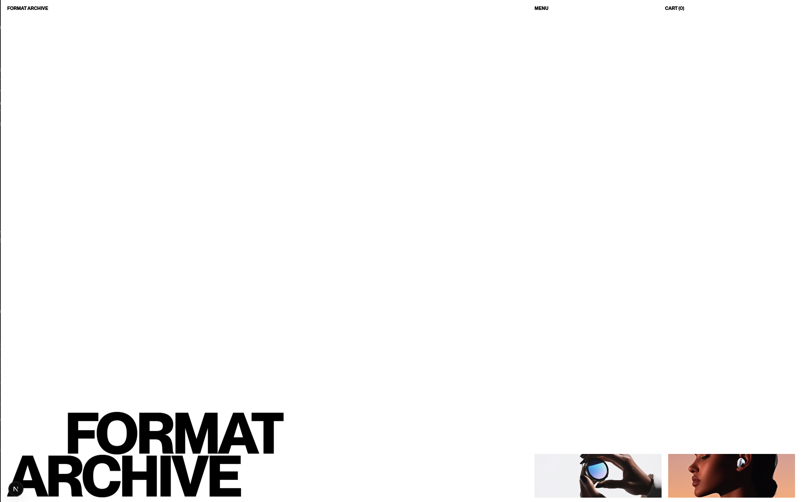

<div align="center">
  <br />
  
  <br />
  <br />

  <div>
    
    
    
    
    
    
  </div>

  <h3 align="center">Format Archive — Modern Product & Editorial Storefront</h3>
  <p align="center">A Next.js site combining a product catalog, editorial stories, smooth scroll, and a persisted cart.</p>
</div>

## Table of Contents

1. [Introduction](#introduction)
2. [Features](#features)
3. [Tech Stack](#tech-stack)
4. [Screenshots](#screenshots)
5. [Getting Started](#getting-started)
6. [Scripts](#scripts)
7. [Project Structure](#project-structure)

## Introduction

Format Archive is a content‑first storefront that blends product cards with editorial sections. A lightweight cart is powered by Zustand with `persist` so items remain after reloads. The App Router architecture keeps pages fast, while Lenis and view transitions deliver a refined scrolling experience.

## Features

- Product and editorial catalog with clean grid layouts
- Cart drawer with add/remove, counters, and persisted state
- Smooth scrolling (Lenis) and page transitions (next‑view‑transitions)
- Animations with GSAP and `@gsap/react`
- App Router structure for performance and DX
- Responsive design and keyboard‑friendly navigation

## Tech Stack

- Next.js 15.3 (App Router)
- React 19
- Zustand 5 with `persist`
- Lenis 1.3
- next‑view‑transitions 0.3
- GSAP 3 + `@gsap/react`

## Screenshots

<p align="center">
  
  <br />
  <em>Minimal hero with strong typographic branding</em>
</p>

<p align="center">
  
  <br />
  <em>Product grid with pricing and editorial blocks</em>
</p>

## Getting Started

### Prerequisites

- Node.js 18+

### Installation

```bash
npm install
```

### Development

```bash
npm run dev
```

Open `http://localhost:3000` in your browser.

### Production

```bash
npm run build
npm start
```

## Scripts

- `dev` – start local dev server
- `build` – production build
- `start` – run the built app
- `lint` – run Next.js ESLint

## Project Structure

```
format-archive/
├─ public/
│  ├─ format-archive1.png
│  └─ format-archive2.png
├─ src/
│  ├─ app/              # App Router pages/sections
│  ├─ components/       # Menu, Cart, layout parts
│  └─ store/            # Zustand cart store (persisted)
├─ next.config.mjs
└─ package.json
```

---

See `project.md` for an in‑depth code walkthrough (state architecture, selectors, and best practices).
