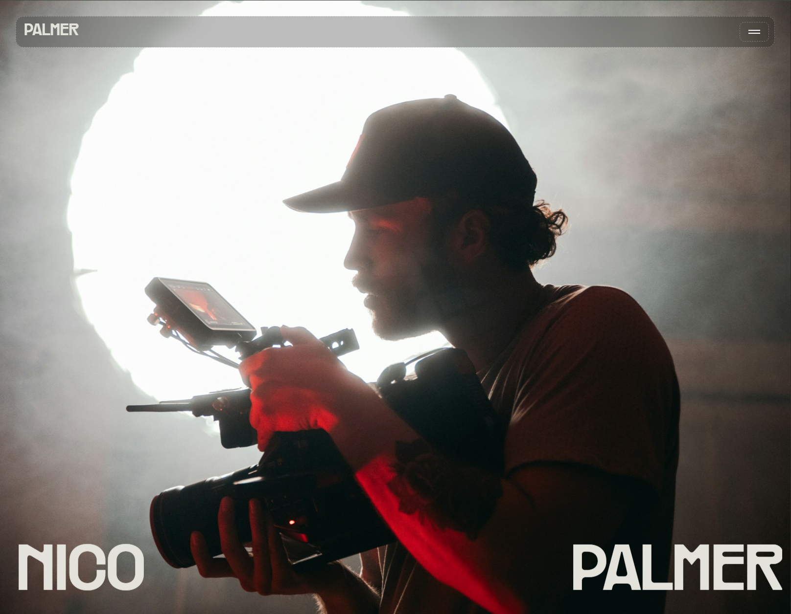
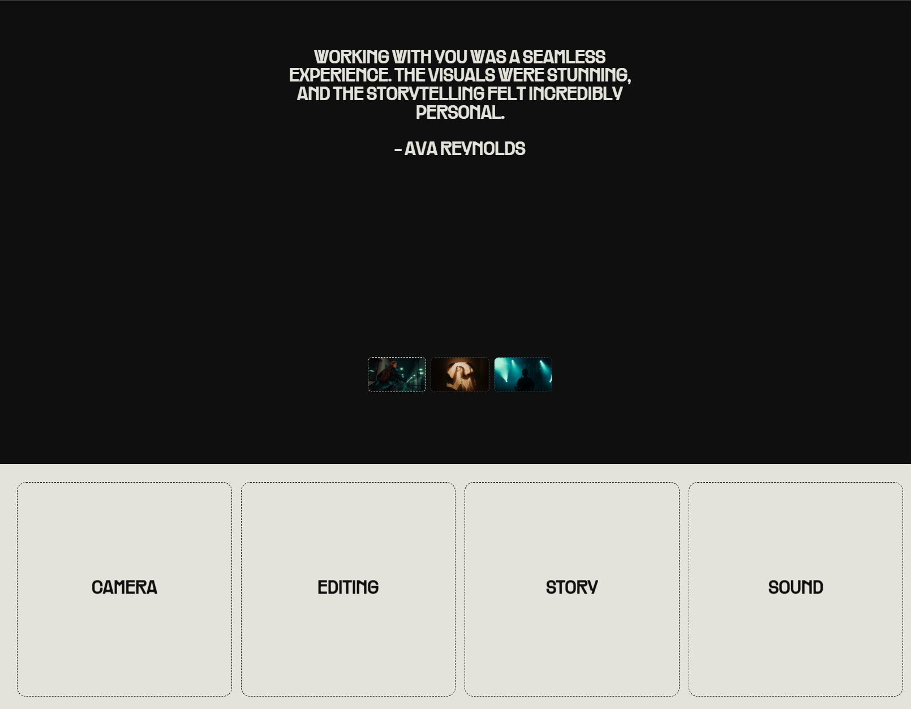

<div align="center">
  <br />
  
  <br />
  <br />

  <div>
    
    
    
    
    
    
    
  </div>

  <h3 align="center">Nico Palmer — Photography & Videography Portfolio</h3>
  <p align="center">A cinematic React + Vite portfolio with smooth scroll, route transitions, and editorial sections.</p>
</div>

## Table of Contents

1. [Introduction](#introduction)
2. [Features](#features)
3. [Tech Stack](#tech-stack)
4. [Screenshots](#screenshots)
5. [Getting Started](#getting-started)
6. [Scripts](#scripts)
7. [Project Structure](#project-structure)

## Introduction

Nico Palmer is a portfolio site for a photographer/videographer. It highlights selected works, services, and testimonials with motion‑driven storytelling and a clean, responsive layout.

## Features

- Project catalog and detail pages
- Smooth scrolling via Lenis
- Section and route transitions with Framer Motion and GSAP
- Client‑side routing with React Router 7
- Responsive, accessibility‑minded layout
- Linting with ESLint

## Tech Stack

- React 19 + Vite 6
- React Router 7
- Framer Motion 11, GSAP 3
- Lenis (smooth scrolling)
- ESLint

## Screenshots

<p align="center">
  
  <br />
  <em>Hero section</em>
</p>

<p align="center">
  
  <br />
  <em>Projects grid</em>
</p>

## Getting Started

```bash
npm install
npm run dev
```

Open `http://localhost:5173` in your browser.

## Scripts

- `dev` – start the Vite dev server
- `build` – production build
- `preview` – preview the production build locally
- `lint` – run ESLint

## Project Structure

```
nico-palmer/
├─ public/
│  
│  
├─ src/
│  ├─ pages/
│  ├─ components/
│  ├─ assets/
│  ├─ App.jsx
│  └─ main.jsx
├─ index.html
└─ vite.config.js


