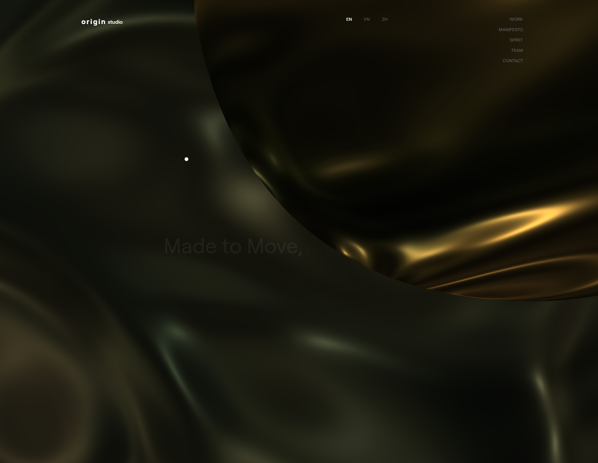

<div align="center">
  <br />
  
  <br />
  <br />

  <div>
    
    
    
    
    
    
    
  </div>

  <h3 align="center">Origin — Motion‑first React Starter</h3>
  <p align="center">A minimal React + Vite starter with smooth scroll, 3D (three.js), and modern routing.</p>
</div>

## Table of Contents

1. [Introduction](#introduction)
2. [Features](#features)
3. [Tech Stack](#tech-stack)
4. [Screenshots](#screenshots)
5. [Getting Started](#getting-started)
6. [Scripts](#scripts)
7. [Project Structure](#project-structure)

## Introduction

Origin is a minimalist starter for building modern React sites quickly. It ships with motion utilities (Framer Motion, GSAP), smooth scrolling, and optional 3D via three.js — ideal for landing pages and creative sites.

## Features

- Clean project structure with Vite dev experience
- Client‑side routing with React Router 7
- Smooth scroll (Lenis) and motion (Framer Motion/GSAP)
- Optional 3D scenes using three.js
- Responsive layout and accessible navigation
- Linting configured with ESLint

## Tech Stack

- React 18 + Vite 6
- React Router 7
- Framer Motion 11, GSAP 3
- Three.js 0.171
- Lenis, @studio‑freight/react‑lenis
- ESLint

## Screenshots

<p align="center">
  
  <br />
  <em>Hero section</em>
</p>

<p align="center">
  
  <br />
  <em>Projects/sections with motion</em>
</p>

## Getting Started

```bash
npm install
npm run dev
```

Open `http://localhost:5173` in your browser.

## Scripts

- `dev` – start the Vite dev server
- `build` – production build
- `preview` – preview the production build locally
- `lint` – run ESLint

## Project Structure

```
origin/
├─ public/
│  ├─ origin1.png  # add later
│  └─ origin2.png  # add later
├─ src/
│  ├─ pages/
│  ├─ components/
│  ├─ assets/
│  ├─ App.jsx
│  └─ main.jsx
├─ index.html
└─ vite.config.js
```

---

Add screenshots into `public/` using the filenames above to enable previews in this README.
