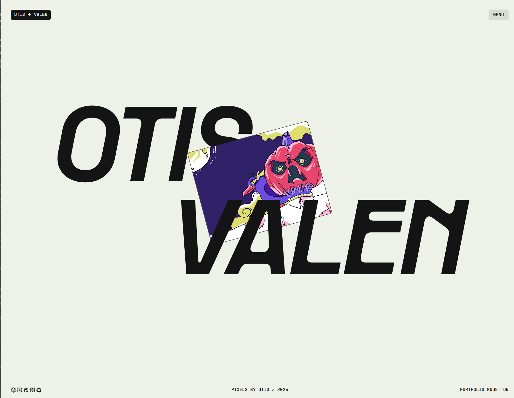
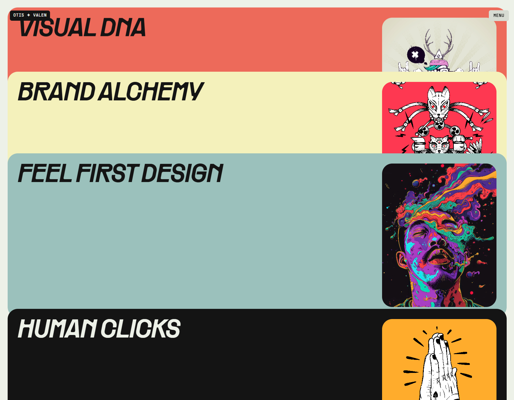

<div align="center">
  <br />
  
  <br />
  <br />

  <div>
    
    
    
    
  </div>

  <h3 align="center">Otis Valen — Creative Portfolio</h3>
  <p align="center">Lightweight portfolio with GSAP animations, smooth scroll, and static pages powered by Vite.</p>
</div>

## Table of Contents

1. [Introduction](#introduction)
2. [Features](#features)
3. [Tech Stack](#tech-stack)
4. [Screenshots](#screenshots)
5. [Getting Started](#getting-started)
6. [Scripts](#scripts)
7. [Project Structure](#project-structure)

## Introduction

This is a minimalist portfolio for a creative professional (designer, photographer, or artist). It showcases works, provides contact details, and communicates a personal visual style through motion and clean typography.

## Features

- Pages: Home, Projects, About, Contact
- Minimal, modern design
- Responsive layout (mobile and desktop)
- Smooth GSAP motions and Lenis scrolling
- Fast loads via Vite and optimized assets
- Straightforward navigation and basic SEO markup

## Tech Stack

- HTML5, CSS
- Vanilla JavaScript
- GSAP 3, Lenis 1.3
- Vite 6 (dev server and build)

## Screenshots

<p align="center">
  
  <br />
  <em>Projects grid</em>
</p>

## Getting Started

```bash
npm install
npm run dev
```

Open `http://localhost:5173` in your browser.

## Scripts

- `dev` – start the Vite dev server
- `build` – production build
- `preview` – preview the production build locally
- `host` – run dev server with `--host`

## Project Structure

```
otis-valen/
├─ public/
│  ├─ 
│  └─ 
├─ css/
├─ js/
├─ index.html
├─ about.html
├─ work.html
└─ contact.html
```

