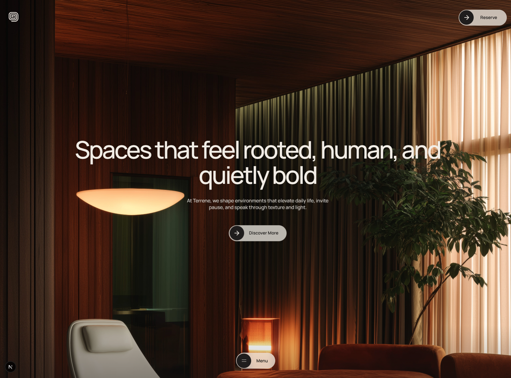
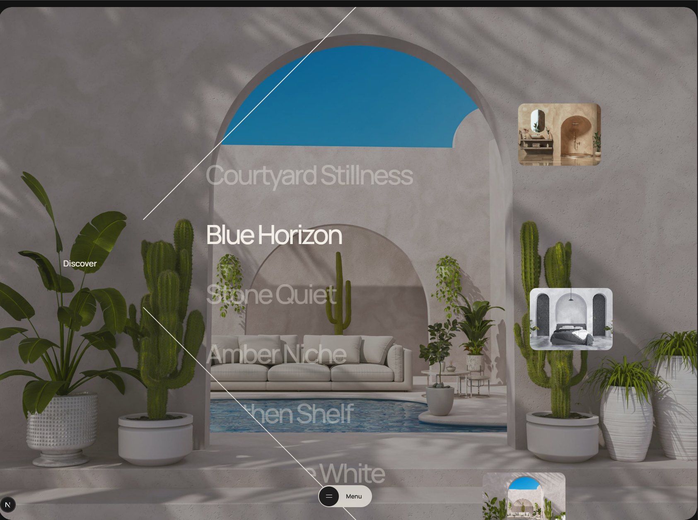

<div align="center">
	<br />
	
	<br />
	<br />

	<div>
		
		
		
		
	</div>

	<h3 align="center">Terrene — Studio Website (Next.js)</h3>
	<p align="center">A visually rich Next.js site used as a portfolio/showcase for interior and spatial design — heavy on imagery, transitions and polished UI.</p>
</div>

## Table of Contents

1. [Showcase](#showcase)
2. [Features](#features)
3. [Tech Stack](#tech-stack)
4. [Screenshots](#screenshots)
5. [Getting Started](#getting-started)
6. [Scripts](#scripts)
7. [Project Structure](#project-structure)
8. [Architecture](#architecture)
9. [UI and Styling](#ui-and-styling)
10. [Code Quality](#code-quality)
11. [Key Modules](#key-modules)
12. [Best Practices](#best-practices)
13. [Infrastructure](#infrastructure)
14. [Conclusions & Recommendations](#conclusions--recommendations)

## Showcase

This project is a production-quality Next.js site for a studio portfolio. It focuses on:

- Visual storytelling through large hero imagery and curated galleries.
- Smooth in-page transitions and view animations (next-view-transitions, GSAP, Lenis).
- Component-driven layout (React + Next app router) enabling re-use across pages.

Typical scenarios and how the stack helps:
- Marketing/portfolio site — static and dynamic pages served by Next with good performance.
- Rich media galleries — `public/` hosts optimized images, Next handles image delivery and caching.
- Smooth UI interactions — GSAP + Lenis provide performant micro-interactions and scroll smoothing.

## Features

- SEO-friendly pages with Next server rendering and static optimizations
- Large media galleries and archived project pages
- Smooth view transitions and animated components
- Modular components and hooks in `src/components` and `src/hooks`

## Tech Stack

- Next.js (15) — app routing, SSR/SSG, performance optimizations
- React (19) — UI layer and component model
- GSAP — advanced animations
- Lenis — smooth scrolling
- next-view-transitions — native-like page transitions

Why these technologies:
- Next.js combines SSR/SSG and modern routing suitable for both marketing and content-heavy pages.
- React provides a component model that scales as the site grows.
- GSAP and Lenis are chosen for animation quality and performance on large visual sites.

## Screenshots

<p align="center">
	
	<br />
	<em>Alternate landing / gallery preview</em>
</p>

## Getting Started

Install dependencies and start the dev server:

```powershell
npm install --legacy-peer-deps
npm run dev
```

Open `http://localhost:3000` (or the port reported by Next) in your browser.

Notes: the repository ships with `react@19.x` and `next@15.x`. If you run into peer dependency conflicts, use `--legacy-peer-deps` for local development or align package versions in `package.json`.

## Scripts

- `dev` — start Next dev server (`next dev`)
- `build` — production build (`next build`)
- `start` — start production server (`next start`)
- `lint` — run `next lint`

These scripts are defined in `package.json`.

## Project Structure

```
terrene/
├─ public/                 # static images, icons and media used by the site
│  ├─ terrene-hero.png
│  ├─ terrene.png
│  └─ ... (galleries / archives / logos)
├─ src/
│  ├─ app/                 # Next app router pages and layouts
│  ├─ components/          # reusable UI components
│  ├─ hooks/               # custom hooks
│  └─ client-layout.js     # client-only layout helpers
├─ next.config.mjs         # Next configuration
├─ package.json
└─ README.md
```

What each folder solves:
- `public/` — hosts large media used by the site; keep heavy assets here for static hosting.
- `src/app/` — Next app routes and page-level layouts; server-side rendering and streaming handled here.
- `src/components/` — encapsulated UI pieces for reuse.

## Architecture

Patterns used:
- Component-driven design: small presentational and container components.
- App router + layout nesting: `src/app/layout.js` provides shared layout and metadata.
- Progressive enhancement: critical content SSR'd, heavy media lazy-loaded on the client.

Example: simple component contract for an image card in `src/components/ImageCard.jsx`:

```jsx
// props: {src, title, href}
export default function ImageCard({ src, title, href }) {
	return (
		<a href={href} className="image-card">
			
			<h3>{title}</h3>
		</a>
	)
}
```

Edge cases considered:
- Large image sizes — use `loading="lazy"` and optimize images in `public/`.
- Slow networks — consider lower-quality placeholders (LQIP) or blurred placeholders.

## UI and Styling

- Styling approach: component-scoped CSS / utility classes. The project keeps large visuals in `public/` and applies CSS for layout/responsiveness.
- Animations: GSAP for component-level sequences; next-view-transitions + React for page transitions.
- Responsiveness: fluid typographic scale and media queries to adapt image crops and layout.

Accessibility notes:
- Ensure images have meaningful `alt` attributes.
- Keep focus states for keyboard navigation and test transitions for reduced-motion preferences.

## Code Quality

- Typing: project is primarily JavaScript; consider migrating critical modules to TypeScript for safer refactors.
- Linting: `next lint` script is present — add consistent ESLint and Prettier configuration if missing.
- Tests: no automated tests included by default. Add visual or integration tests (Playwright/Cypress) for core pages if needed.

## Key Modules

1) `src/app/layout.js` — global layout, metadata, and providers (Lenis/animation providers)
	 - Role: attach global styles, fonts, and layout wrappers.
2) `src/components/Hero.jsx` — hero section with imagery and CTA
	 - Role: top-of-site presentation, responsive image handling.
3) `src/components/Gallery.jsx` — gallery grid and lightbox behavior
	 - Role: renders project thumbnails and handles navigation into project pages.
4) `src/hooks/useSmoothScroll.js` — Lenis integration and scroll controls
	 - Role: initializes Lenis and exposes scroll controls for components.

## Best Practices

- Keep heavy assets in `public/` and optimize images for web (WebP/AVIF + proper sizes).
- Prefer lazy loading for gallery images and use placeholder elements to avoid layout shifts.
- Centralize animation initialization (GSAP timelines, Lenis) to avoid duplicated listeners.

## Infrastructure

Local commands:

```powershell
npm install --legacy-peer-deps
npm run dev
npm run build
npm run start
```

CI/CD recommendations:
- Add a GitHub Actions workflow to run `npm ci && npm run build` on push to main/master.
- Add an accessibility/visual regression step (Playwright or Percy) for critical pages.

## Conclusions & Recommendations

Strengths:
- High-quality visuals and polished transitions — strong portfolio presentation.
- Modern Next.js architecture that supports SSR and good performance.

Improvements:
- Add image optimization pipeline (WebP/AVIF generation) and consider placeholders to improve CLS.
- Add ESLint/Prettier and a small CI step to enforce code quality.
- Introduce basic visual/integration tests for core user flows.

---

This README was created to match the style used across the mono-repo and uses images from `public/` for illustration.
