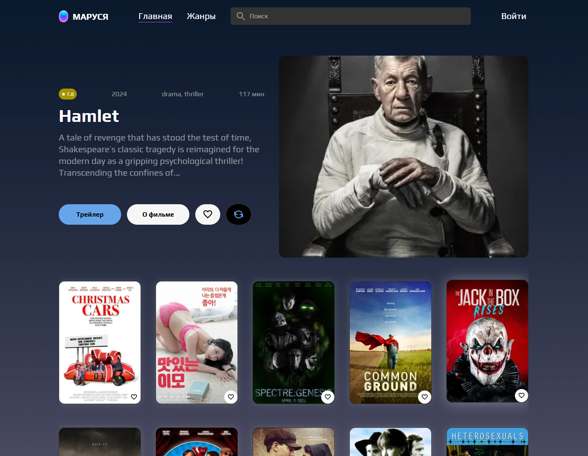
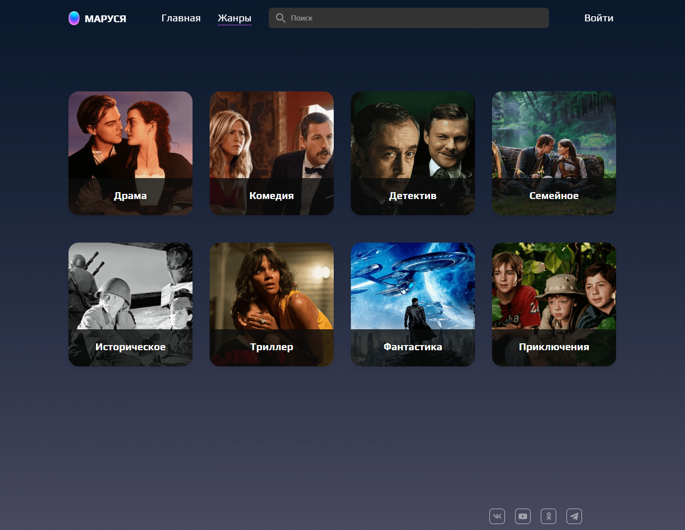
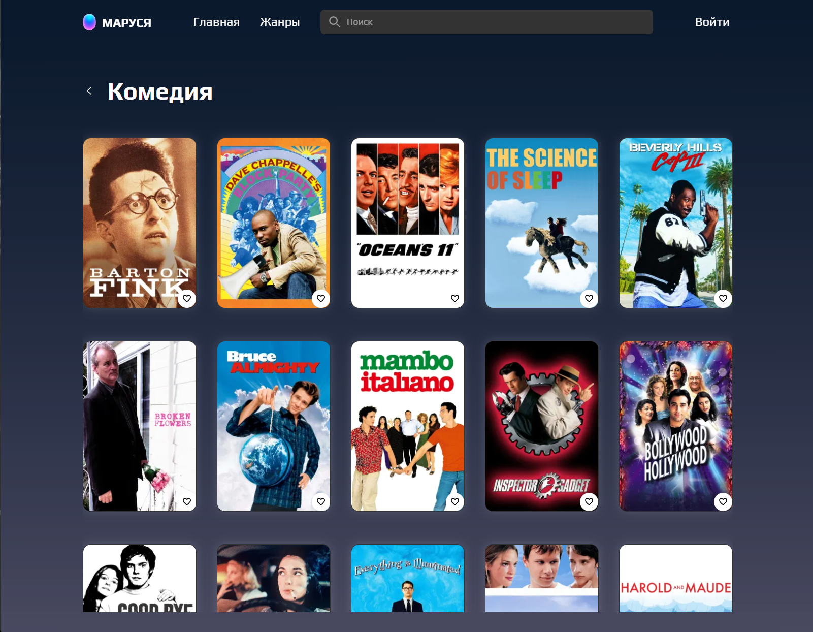

<div align="center">
  <br />
  
  <br />
  <br />

  <div>
    
    
    
    
    
    
    
  </div>

  <h3 align="center">VK Marusya — Online Cinema Platform</h3>
  <p align="center">A modern TypeScript React application for watching movies and trailers with genre filtering, search functionality, and user authentication.</p>
</div>

## Table of Contents

1. [Introduction](#introduction)
2. [Features](#features)
3. [Tech Stack](#tech-stack)
4. [Screenshots](#screenshots)
5. [Getting Started](#getting-started)
6. [Scripts](#scripts)
7. [Project Structure](#project-structure)

## Introduction

VK Marusya is a comprehensive online cinema platform built with modern React and TypeScript. It provides users with the ability to browse movies, watch trailers, search for films by title, filter by genres, manage favorites, and authenticate securely. The application features a clean, responsive design with advanced functionality for an optimal movie-watching experience.

## Features

### 🎬 **Cinema Functionality**
- **Movie Catalog**: Browse extensive collection of movies with detailed information
- **Trailer Playback**: Watch movie trailers with integrated YouTube player
- **Genre Filtering**: Filter movies by multiple genres (drama, comedy, thriller, etc.)
- **Advanced Search**: Real-time search with debounced input and autocomplete
- **Favorites System**: Add/remove movies to personal favorites list
- **User Authentication**: Secure login and registration system

### 🛠 **Technical Features**
- **TypeScript**: Full type safety with strict configuration
- **State Management**: Redux Toolkit for complex state handling
- **Routing**: React Router 6 with protected routes
- **API Integration**: Axios-based API with error handling
- **PWA Support**: Progressive Web App capabilities
- **Testing**: Jest unit tests with comprehensive coverage
- **Performance**: Optimized builds with Vite and bundle analysis

## Tech Stack

- React 18, TypeScript 5
- Vite 6, `@vitejs/plugin-react`
- Redux Toolkit 2, React Redux, Redux (core)
- React Router DOM 6
- Axios, qs
- Jest 30, ts-jest
- Prettier, ESLint
- Vite plugins: PWA, compression, tsconfig paths, visualizer

## Screenshots

<p align="center">
  
  <br />
  <em>App shell and navigation</em>
</p>

<p align="center">
  
  <br />
  <em>Feature screen</em>
</p>

## Getting Started

```bash
npm install
npm run dev
```

Open `http://localhost:5173` in your browser.

## Scripts

- `dev` – start Vite dev server
- `build` – production build
- `build:prod` – production build (explicit mode)
- `build:analyze` – build and print analysis path
- `preview` – preview built app
- `lint` – run ESLint
- `format` – format sources with Prettier
- `test` / `test:watch` / `test:coverage` – run Jest tests

## Project Structure

```
react_project-VK/react_project-1/ВК-Маруся/
├─ public/
│  ├─ 
│  └─ 
├─ src/
│  ├─ app/ core modules
│  ├─ components/
│  ├─ features/
│  ├─ pages/
│  └─ shared/
├─ index.html
├─ vite.config.ts
└─ tsconfig.json
```


